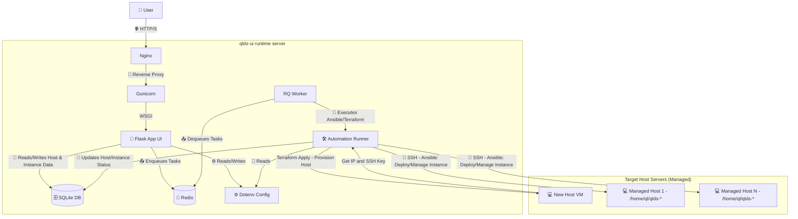

# Technical Documentation

This document outlines the technical stack, development environment setup, key technical decisions, and design patterns used in the QLSM project.

## Technology Stack

* **Backend:** Flask (Python)
    *   **Authentication:** `Flask-JWT-Extended` for JWT-based authentication using `HttpOnly` cookies.
* **Database:** SQLite
* **Frontend (New):** React (SPA using Vite for build process)
    *   **State Management:**
        *   `ThemeContext` for dark/light mode.
        *   `LoadingContext` for global loading indicators.
        *   `AuthContext` (`frontend-react/src/contexts/AuthContext.jsx`) for managing client-side authentication state (e.g., `isAuthenticated`, `currentUser`). It verifies session status on load by calling `/api/auth/status` (which checks the `HttpOnly` JWT cookie) and handles login/logout contexts.
* **UI Components (New):**
   *   Headless UI (for accessible, unstyled primitives like Menus, Listbox, Tabs, Transitions, Portals, used in action menus and the Add Instance page)
   *   `@floating-ui/react-dom` (for robust positioning of floating elements like dropdown menus in `HostActionsMenu.jsx` and `InstanceActionsMenu.jsx`)
   *   `lucide-react` (for icons, including sort icons, button icons, and dropdown indicators)
   *   `CodeMirrorEditor.jsx` (reusable component for text editing with syntax highlighting, used in `InstanceConfigTabs.jsx`)
   *   `InstanceBasicInfoForm.jsx`, `InstancePresetSelector.jsx`, `InstanceConfigTabs.jsx` (components for the Add Instance page, structuring the form and config editing)
* **Styling (New):** Tailwind CSS. Modernized styling for dropdowns (Listboxes) and Tabs on the Add Instance page.
* **Frontend Features:**
    *   Client-side table sorting.
    *   CodeMirror 6 integration for editing Quake Live configuration files (`server.cfg`, `mappool.txt`, `access.txt`, `workshop.txt`, `factory.factories`) with custom language modes for basic syntax highlighting.
* **Task Queue:** Flask-RQ2 + Redis
* **Automation (Instance Mgmt):** Ansible (executed via direct `os.system` calls to `ansible-playbook` CLI within RQ tasks)
* **Automation (Host Provisioning):** Terraform (executed via `subprocess` calls to `terraform` CLI within RQ tasks)
* **WSGI Server:** Gunicorn
* **Process Manager:** Systemd
* **Reverse Proxy:** Nginx (Basic setup for V1)
* **Logging:** Python's standard `logging` module.
* **Version Control:** Git
* **Environment:** Linux VPS (Ubuntu Recommended)
* **Testing:** Pytest, Pytest-Mock (Recommended)
* **Architecture:** Simple Monolith (Flask App [via Gunicorn] + RQ Worker + Redis [installed via apt])
* **Deployment Target (Instances):** Quake Live Dedicated Server (QLDS) + minqlx installed directly on host (`/home/ql/qlds-{id}`) via Ansible.
* **Deployment Target (Hosts):** Linux VMs provisioned via Terraform (e.g., on Vultr, GCP).

## Architecture Diagram (Reflecting Host Provisioning & Instance Deployment)



## Flask Application Structure

The Flask application follows the application factory pattern, which provides several benefits:

-   **Modularity:** The application is organized into separate modules with clear responsibilities.
-   **Testability:** The factory pattern makes it easier to create test instances of the application.
-   **Configuration:** Different configurations can be applied based on the environment (development, production, testing).

### Key Components

-   **App Factory (`ui/__init__.py`):** Creates and configures the Flask application.
-   **Configuration (`ui/config.py`):** Loads settings from environment variables. Includes settings for `Flask-JWT-Extended` (e.g., `JWT_TOKEN_LOCATION`, `JWT_COOKIE_SECURE`, `JWT_COOKIE_SAMESITE`, `JWT_ACCESS_COOKIE_NAME`) and general session cookie attributes.
-   **Database Models (`ui/models.py`):** Defines the SQLAlchemy ORM models (User, Host, QLInstance, ConfigPreset).
-   **Database Helpers (`ui/database.py`):** Provides CRUD operations for models and database initialization.
-   **CLI Modules (`ui/user_cli.py`, `ui/preset_cli.py`):** Provide focused Flask CLI commands such as `flask create-user`, `flask create-default-admin`, and preset management commands.
-   **Authentication (`Flask-JWT-Extended`):**
    *   JWTs are issued upon successful login and stored in `HttpOnly` cookies.
    *   The `SECRET_KEY` from `ui/config.py` is used for signing JWTs.
    *   Protected API endpoints are decorated with `@jwt_required()` from `Flask-JWT-Extended`.
    *   Key authentication routes in `ui/routes/auth_api_routes.py`:
        *   `/api/auth/login`: Validates credentials, creates a JWT, and sets it as an `HttpOnly` cookie via `set_access_cookies`.
        *   `/api/auth/status`: A protected route that allows the frontend to check if the current session (via cookie) is valid and retrieve user information.
        *   `/api/auth/logout`: A protected route that clears the JWT cookie via `unset_jwt_cookies`.
-   **Routes (`ui/routes/` package):** Defines application endpoints using Flask Blueprints:
    *   `auth_api_routes.py`: Handles authentication and session management as described above.
    -   `index_routes.py`: Handles the main index page.
    *   `host_routes.py`: Handles CRUD operations for Hosts, protected by `@jwt_required()`.
    *   `instance_routes.py`: Handles CRUD operations for QLInstances, protected by `@jwt_required()`.
    *   `preset_api_routes.py`: Handles CRUD operations for ConfigPresets, protected by `@jwt_required()`.
    *   `server_status_routes.py`: Handles live status retrieval (`GET /api/server-status`) and workshop preview lookup (`GET /api/server-status/workshop-preview/<workshop_id>`).
    *   `settings_routes.py`: Handles application settings management (API keys, rate limit config).
    *   `user_routes.py`: Handles user management endpoints.
    *   `draft_routes.py`: Handles draft/pending instance configuration management.
    *   `script_routes.py`: Handles script management endpoints.
    *   `factory_routes.py`: Handles factory file management.
    *   `external_api_routes.py`: Versioned external API at `/api/v1/`. Uses Bearer token authentication via the `ApiKey` model (not JWT cookies). Exposes a rate-limited `GET /api/v1/instances` endpoint for external service integration.

### Database Models

The application has six database models: `User`, `Host`, `QLInstance`, `ConfigPreset`, `ApiKey`, and `AppSetting`.

**Host Model:** Represents a target server where Quake Live instances can be deployed. These hosts are provisioned via Terraform triggered by the UI.

```python
import enum

class HostStatus(enum.Enum):
    PENDING = 'pending'
    PROVISIONING = 'provisioning'
    PROVISIONED_PENDING_SETUP = 'provisioned_pending_setup'
    ACTIVE = 'active'
    REBOOTING = 'rebooting'
    CONFIGURING = 'configuring'
    DELETING = 'deleting'
    ERROR = 'error'
    UNKNOWN = 'unknown'

class Host(db.Model):
    id = db.Column(db.Integer, primary_key=True)
    name = db.Column(db.String(100), nullable=False, unique=True)
    ip_address = db.Column(db.String(50), nullable=True)
    provider = db.Column(db.String(50), nullable=False)  # e.g., 'vultr', 'gcp', 'standalone'
    workspace_name = db.Column(db.String(150), nullable=True, unique=True)
    region = db.Column(db.String(50), nullable=True)
    machine_size = db.Column(db.String(50), nullable=True)
    ssh_user = db.Column(db.String(50), default='ansible')
    ssh_key_path = db.Column(db.String(255), nullable=True)
    ssh_port = db.Column(db.Integer, default=22)
    os_type = db.Column(db.String(50), nullable=True)  # e.g., 'debian', 'ubuntu'
    is_standalone = db.Column(db.Boolean, default=False)  # user-provided host (not Terraform)
    timezone = db.Column(db.String(100), nullable=True)  # IANA timezone name
    auto_restart_schedule = db.Column(db.String(100), nullable=True)  # cron expression
    status = db.Column(db.Enum(HostStatus), default=HostStatus.PENDING, nullable=False)
    qlfilter_status = db.Column(db.Enum(QLFilterStatus), default=QLFilterStatus.UNKNOWN, nullable=True)
    logs = db.Column(db.Text, nullable=True)
    last_updated = db.Column(db.DateTime, default=datetime.datetime.utcnow, onupdate=datetime.datetime.utcnow)
    created_at = db.Column(db.DateTime, default=datetime.datetime.utcnow)

    # Relationship to QLInstances
    instances = db.relationship('QLInstance', backref='host', lazy=True, cascade="all, delete-orphan")

```

### Self-Host Address Contract

For `provider=self`, `Host.ip_address` remains the client-facing server address shown in the UI and used in connect links. Automation does not SSH to that stored address. QLSM resolves a hidden management target inside the Docker deployment and uses that target for self-host Ansible runs and status polling.

### Self-Host Redis Contract

For `provider=self`, game instances reuse the QLSM Docker Redis on `127.0.0.1:6379`.
QLSM reserves Redis `DB 0`; minqlx instances use `DB 1..4` derived from `port - 27959`.
Self-host minqlx services receive `qlx_redisAddress`, `qlx_redisPassword`, and `qlx_redisDatabase` explicitly at deploy time.

**QLInstance Model:** Represents a Quake Live server instance running on a specific `Host`.

```python
class QLInstance(db.Model):
    id = db.Column(db.Integer, primary_key=True)
    name = db.Column(db.String(100), nullable=False, unique=True)
    port = db.Column(db.Integer, nullable=False)
    hostname = db.Column(db.String(255), nullable=False)  # sv_hostname
    lan_rate_enabled = db.Column(db.Boolean, default=False, nullable=False)
    qlx_plugins = db.Column(db.Text, nullable=True)  # comma-separated plugin list
    zmq_rcon_port = db.Column(db.Integer, nullable=True)
    zmq_rcon_password = db.Column(db.String(255), nullable=True)
    zmq_stats_port = db.Column(db.Integer, nullable=True)
    zmq_stats_password = db.Column(db.String(255), nullable=True)
    status = db.Column(db.Enum(InstanceStatus), default=InstanceStatus.IDLE, nullable=False)
    logs = db.Column(db.Text, nullable=True)
    last_updated = db.Column(db.DateTime, default=datetime.datetime.utcnow, onupdate=datetime.datetime.utcnow)
    created_at = db.Column(db.DateTime, default=datetime.datetime.utcnow)

    # Foreign Key to Host
    host_id = db.Column(db.Integer, db.ForeignKey('host.id'), nullable=False)

```

**ConfigPreset Model:** Stores preset metadata. Config file contents are stored on the filesystem; the model holds a `path` pointer to the preset directory.

```python
class ConfigPreset(db.Model):
    id = db.Column(db.Integer, primary_key=True)
    name = db.Column(db.String(100), nullable=False, unique=True)
    description = db.Column(db.Text, nullable=True)
    path = db.Column(db.String(500), nullable=True)  # filesystem path to preset config folder
    last_updated = db.Column(db.DateTime, default=datetime.datetime.utcnow, onupdate=datetime.datetime.utcnow)
    created_at = db.Column(db.DateTime, default=datetime.datetime.utcnow)
```

**ApiKey Model:** Stores API keys for external service authentication. Used by `external_api_routes.py` to validate `Authorization: Bearer <key>` headers.

**AppSetting Model:** Generic key-value store for application settings (e.g., rate limit values). Accessed via `settings_routes.py`.

## Testing Framework

The project uses pytest for testing, with fixtures defined in `tests/conftest.py`:

-   **app:** Creates a test Flask application with an in-memory SQLite database.
-   **client:** Provides a test client for making requests to the application.
-   **runner:** Provides a test CLI runner for testing CLI commands.
-   **app_context:** Provides an application context for tests that need it.
-   **Test Structure:** Tests are organized into separate files within the `tests/` directory based on the feature or module being tested (e.g., `test_db.py`, `test_host_routes.py`, `test_task_provision_host.py`).

## Automation Configuration

### Ansible (Host Setup & Instance Management)

-   **Configuration File:** Project-specific Ansible settings are managed in `ansible.cfg` located in the project root (`/home/rage/qlds-ui`). Includes `host_key_checking = False` under `[defaults]` to bypass SSH host key prompts for newly provisioned hosts.
-   **Inventory:** Ansible uses a combination of static and dynamic inventory files located within the `ansible/inventory/` directory (specified in `ansible.cfg`).
    -   **Static:** `ansible/inventory/hosts.yml` can define manually configured servers (if any).
    -   **Dynamic (Terraform Generated):** Terraform generates a unique inventory snippet file per provisioned host (e.g., `ansible/inventory/my-host-name_vultr_host.yml`) using the `templates/vultr_hosts.yml.tftpl` template. This file contains the host's IP, the specific SSH user (`ansible`), and the absolute path to the generated private key.
    -   **Combined Inventory:** Ansible automatically reads all `.yml` files within the specified inventory directory.
-   **Playbook Structure:**
    -   **`ansible/playbooks/setup_host.yml`:** Performs the initial one-time setup on a newly provisioned host. Installs prerequisites (including `iptables-persistent`, and `redis-server` only when the host runtime needs its own Redis), configures the firewall using a template (`ansible/templates/iptables.rules.j2`) that defines both filter and NAT rules which are applied atomically via `iptables-restore` and persisted, creates the `ql` user, installs base SteamCMD/QLDS/minqlx to shared locations (`/home/ql/qlds-base`, `/home/ql/minqlx-shared`), and syncs common assets (`/home/ql/assets/common`).
    -   **`ansible/playbooks/add_qlds_instance.yml`:** Adds a new QLDS instance to a pre-configured host. Creates the instance directory (`/home/ql/qlds-{id}`), copies shared resources (QLDS base, minqlx, common assets) into the instance directory, syncs instance-specific configuration files from the UI server (`configs/<host>/<id>/`), installs instance-specific Python dependencies, and manages the systemd service.
    -   **`ansible/playbooks/manage_qlds_service.yml`:** Manages the `qlds@<id>.service` systemd service (start, stop, restart, delete service file).
    -   **`ansible/playbooks/get_qlds_logs.yml`:** Retrieves logs for a specific instance service.
    -   **`ansible/playbooks/setup_qlfilter.yml`:** Installs QLFilter (eBPF/XDP packet filter) on a target host.
    -   **`ansible/playbooks/remove_qlfilter.yml`:** Uninstalls QLFilter from a target host.
    -   **`ansible/playbooks/check_qlfilter_status.yml`:** Checks the installation and service status of QLFilter on a target host.
    -   *(Other playbooks like `sync_configs_and_restart.yml` may exist for specific update operations)*
-   **Playbook Execution:** Playbooks are executed via direct `subprocess` calls to the `ansible-playbook` CLI within RQ background tasks defined in `ui/tasks.py`, which call logic functions within the `ui/task_logic/` package.
    -   **Host Setup (`ui/task_logic/ansible_host_setup.py`):** The `setup_host_ansible_logic` function (called by the `setup_host_ansible` task, which is enqueued by `provision_host_logic` in `ui/task_logic/terraform_provision.py` after successful Terraform apply) executes `setup_host.yml` targeting the new host's IP using the generated SSH key.
    -   **Instance Management (`ui/task_logic/ansible_instance_mgmt.py`):** Functions like `deploy_instance_logic`, `restart_instance_logic`, `delete_instance_logic` execute the relevant playbooks (`add_qlds_instance.yml`, `manage_qlds_service.yml`). They retrieve host details (IP, user, key path) from the associated `Host` object in the database and pass necessary instance-specific information (like `id`, `port`, `qlds_args`, `host_name`) as extra variables (`-e`). The core playbook execution is handled by a helper in `ui/task_logic/ansible_runner.py`.
    -   **QLFilter Management (`ui/task_logic/ansible_qlfilter_mgmt.py`):** Functions like `install_qlfilter_logic`, `uninstall_qlfilter_logic`, `check_qlfilter_status_logic` execute the QLFilter-related playbooks, targeting a specific host.
-   **QLDS Service Management Playbook (`manage_qlds_service.yml`):** Manages the `qlds@<id>.service` systemd service on the target host using the `ansible/templates/qlds@.service.j2` template.
    *   **Purpose:** Start, stop, restart, enable, disable, delete service file, or query the status of a specific QLDS instance service. Ensures persistence and allows dynamic command-line arguments.
    *   **Usage:** `ansible-playbook manage_qlds_service.yml -i <inventory> -l <target_host> --extra-vars "id=<instance_id> [service_state=<state>] [qlds_args='<args>'] [service_enabled=<yes|no>] [service_action=<action>]"`
    *   **States/Actions:** `service_state` (`started`, `stopped`, `restarted`, `status`) or `service_action` (`delete` - stops and removes service file).
    *   **Args:** `qlds_args` string is required for states that manage the service process (start, restart). Example: `qlds_args='+set net_port 27963 +set sv_hostname \"My Server\"'`
-   **QLDS Log Retrieval Playbook (`get_qlds_logs.yml`):** Retrieves systemd journal logs for a specific QLDS instance service.
    *   **Purpose:** Fetch recent logs generated by the service.
    *   **Usage:** `ansible-playbook get_qlds_logs.yml -i <inventory> -l <target_host> --extra-vars "id=<instance_id> [lines=<num_lines>]"`
    *   **Lines:** Defaults to 100 lines if not specified.
-   **Ansible Run Logging:**
    *   Detailed stdout and stderr from Ansible playbook executions (triggered by tasks in `ui/task_logic/ansible_instance_mgmt.py`) are no longer stored directly in the `QLInstance.logs` database field.
    *   Instead, these verbose logs are saved to individual files within the `logs/ansible_runs/` directory (e.g., `logs/ansible_runs/instance_<instance_id>_<task_name>_<job_id>_<timestamp>.log`). This is managed by the `save_ansible_run_log` function in `ui/task_logic/file_logger.py`.
    *   The `QLInstance.logs` database field now stores concise, timestamped status messages, including a reference to the path of the detailed log file.
-   **Terraform Run Logging:**
    *   Detailed stdout and stderr from Terraform CLI executions (triggered by tasks in `ui/task_logic/terraform_provision.py` and `ui/task_logic/terraform_destroy.py`) are no longer stored directly in the `Host.logs` database field.
    *   Instead, these verbose logs are saved to individual files within the `logs/terraform_runs/` directory (e.g., `logs/terraform_runs/host_<host_id>_<task_name>_<command>_<job_id>_<timestamp>.log`). This is managed by the `save_terraform_run_log` function in `ui/task_logic/file_logger.py`.
    *   The `Host.logs` database field now stores concise, timestamped status messages, including a reference to the path of the detailed log file for each Terraform command executed.

### Terraform (Host Provisioning)

-   **Terraform Modules:** Reusable Terraform modules (e.g., `terraform/modules/gcp_instance`, `terraform/modules/vultr_instance`) define the infrastructure for different cloud providers.
-   **Root Configuration:** A generalized root configuration exists for each provider (e.g., `terraform/vultr-root/main.tf`). This configuration utilizes the corresponding module.
-   **Workspace Strategy:** Terraform Workspaces are used to manage the state of each provisioned host independently using the same root configuration. Each host corresponds to a unique workspace (e.g., `cline-test-host`).
-   **Task Execution:** RQ background tasks defined in `ui/tasks.py` orchestrate Terraform execution using the `subprocess` module, calling logic functions within the `ui/task_logic/` package. The core command execution is handled by a helper in `ui/task_logic/terraform_runner.py`.
    -   **Provisioning (`ui/task_logic/terraform_provision.py` - `provision_host_logic` function):**
        *   Determines the correct Terraform root directory based on the selected provider.
        *   Generates a unique workspace name (based on the host name) and stores it in the `Host` database record.
        *   Runs `terraform init`, `terraform workspace new <ws_name>`, `terraform workspace select <ws_name>`.
        *   Runs `terraform apply` passing required variables (`instance_name`, `vultr_region`, `vultr_plan`) via `-var` flags and using `-auto-approve`.
        *   Runs `terraform output -json` to capture outputs.
        *   Parses JSON output to retrieve `main_ip` and `private_key_path`.
        *   Updates the `Host` record in the database with the IP and key path.
        *   **Enqueues the `setup_host_ansible` task (which calls logic in `ui/task_logic/ansible_host_setup.py`) to run `setup_host.yml` on the new host.**
        *   The `setup_host_ansible_logic` function updates the `Host` status to `ACTIVE` on successful Ansible run.
    -   **Destruction (`ui/task_logic/terraform_destroy.py` - `destroy_host_logic` function):**
        *   Determines the Terraform root directory and workspace name from the `Host` record.
        *   Runs `terraform workspace select <ws_name>`.
        *   Runs `terraform destroy` with appropriate variables and `-auto-approve`.
        *   Runs `terraform workspace select default` and `terraform workspace delete <ws_name>` to clean up the workspace.
        *   Deletes the generated SSH key file (`ssh-keys/`) and Ansible inventory snippet (`ansible/inventory/`).
        *   Deletes the `Host` record from the database.
-   **Variable Passing:** User-selected provider, region, and machine size are stored in the `Host` database record and passed as variables (`-var="vultr_region=..."`, `-var="vultr_plan=..."`) to `terraform apply` and `destroy` commands by the background task. The host name is used for the `instance_name` variable and the workspace name.
-   **Startup Script:** The path to the `ansible_client_setup.sh` startup script is hardcoded within `terraform/vultr-root/main.tf` using `file("${path.root}/../startup_scripts/ansible_client_setup.sh")`.
-   **State Management:** Uses the default local backend with workspaces. State files are stored in `terraform/<provider>-root/terraform.tfstate.d/<workspace_name>/terraform.tfstate`. This is suitable for single-user operation but a remote backend (S3, GCS) is recommended for collaboration or production robustness.
-   **Output Handling:** Terraform outputs (`main_ip`, `private_key_path`) are captured by running `terraform output -json` in the task logic and stored in the corresponding `Host` record in the database.
-   **Inventory Snippet Generation:** The `terraform/vultr-root/main.tf` configuration uses a `local_file` resource to generate an Ansible inventory snippet (`ansible/inventory/<instance_name>_vultr_host.yml`) using the `templates/vultr_hosts.yml.tftpl` template. Absolute paths (`abspath("${path.root}/../../ansible/...")`) are used to ensure the file is created in the correct project directory.
-   **Security:** Secure handling of cloud provider credentials (via environment variables) and generated SSH keys is critical. SSH private keys generated by Terraform are stored in `ssh-keys/` with `0600` permissions, and their paths recorded in the database. The `destroy_host` task cleans up these keys.

## 99k LAN Rate Mode

The 99k LAN Rate Mode is a per-instance configurable feature that enables high-bandwidth LAN server functionality using NAT-based iptables rules. This allows servers to bypass the default 25k rate limit for clients connecting over the internet.

### Overview

When enabled, LAN rate mode:
1. Configures the QLDS server with LAN-specific settings (`sv_serverType 1`, `sv_lanForceRate 1`)
2. Sets up NAT iptables rules to redirect external traffic through localhost
3. Enables the `route_localnet` kernel parameter to allow routing to 127.0.0.1

When disabled (default for internet servers):
1. Configures the QLDS server for internet mode (`sv_serverType 2`, `sv_lanForceRate 0`)
2. No NAT rules are applied - traffic goes directly to the server

### Server Arguments

**LAN Rate Enabled:**
```
+set net_strict 1 +set sv_serverType 1 +set sv_lanForceRate 1
```

**LAN Rate Disabled (Internet Mode):**
```
+set sv_serverType 2 +set sv_lanForceRate 0
```

### Network Configuration

The LAN rate mode uses iptables NAT rules to make external clients appear as localhost connections:

**NAT Rules (per port with LAN rate enabled):**
```bash
# PREROUTING: Redirect incoming packets to localhost
iptables -t nat -A PREROUTING -p udp --dport <port> -j DNAT --to-destination 127.0.0.1

# POSTROUTING: Source NAT for responses
iptables -t nat -A POSTROUTING -p udp -d 127.0.0.1 --dport <port> -j SNAT --to-source 127.0.0.1

# INPUT (required for NAT to work properly)
iptables -t nat -A INPUT -d 127.0.0.1 -j SNAT --to-source 127.0.0.1
```

**Kernel Parameter:**
```bash
sysctl -w net.ipv4.conf.all.route_localnet=1
```

### Implementation Details

-   **Database:** `lan_rate_enabled` boolean field on `QLInstance` model (default: `false`)
-   **API Endpoint:** `PUT /api/instances/<id>/lan-rate` to toggle LAN rate on existing instances
-   **Ansible Playbooks:**
    -   `add_qlds_instance.yml`: Conditionally sets up route_localnet when deploying with LAN rate enabled
    -   `update_instance_lan_rate.yml`: Toggles LAN rate on existing instances (updates systemd service, adds/removes NAT rules, restarts service)
-   **Task Logic:** `reconfigure_instance_lan_rate_logic()` in `ui/task_logic/ansible_instance_mgmt.py`

### Host-Wide Settings

The `route_localnet` sysctl setting is host-wide. Once enabled for any instance with LAN rate, it remains enabled. This is safe because:
- Enabling it when not needed is harmless
- Disabling it when any instance still needs it would break those instances

The NAT iptables rules are per-instance (per-port) and are added/removed individually.

### Frontend

-   **Add Instance Form:** Checkbox to enable LAN rate mode (default: unchecked)
-   **Instance Details Modal:** Toggle switch to enable/disable LAN rate on existing instances
