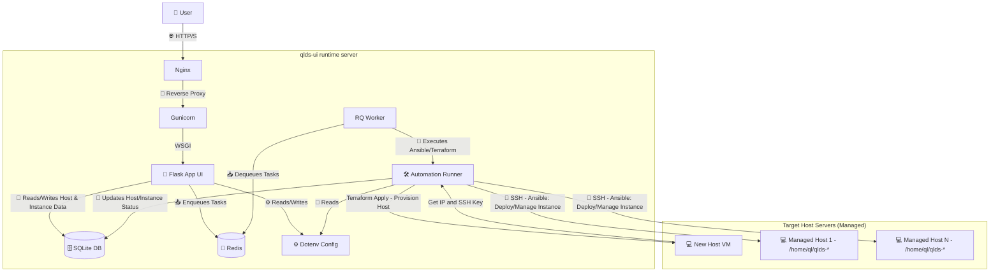

# Technical Documentation

This document outlines the technical stack, development environment setup, key technical decisions, and design patterns used in the QLSM project.

## Technology Stack

* **Backend:** Flask (Python)
    *   **Authentication:** `Flask-JWT-Extended` for JWT-based authentication using `HttpOnly` cookies.
* **Database:** SQLite
* **Frontend (New):** React (SPA using Vite for build process)
    *   **State Management:**
        *   `ThemeContext` for dark/light mode.
        *   `LoadingContext` for global loading indicators.
        *   `AuthContext` (`frontend-react/src/contexts/AuthContext.jsx`) for managing client-side authentication state (e.g., `isAuthenticated`, `currentUser`). It verifies session status on load by calling `/api/auth/status` (which checks the `HttpOnly` JWT cookie) and handles login/logout contexts.
* **UI Components (New):**
   *   Headless UI (for accessible, unstyled primitives like Menus, Listbox, Tabs, Transitions, Portals, used in action menus and the Add Instance page)
   *   `@floating-ui/react-dom` (for robust positioning of floating elements like dropdown menus in `HostActionsMenu.jsx` and `InstanceActionsMenu.jsx`)
   *   `lucide-react` (for icons, including sort icons, button icons, and dropdown indicators)
   *   `CodeMirrorEditor.jsx` (reusable component for text editing with syntax highlighting, used by the unified file manager)
   *   `FileManager.jsx` and `frontend-react/src/components/fileManager/` (shared file tree, editor panel, upload/create/rename/delete controls, binary details panel, and adapter-based state handling for configs, plugins, and factories)
   *   `frontend-react/src/components/presetManager/` (`PresetManagerModal`, load/save tabs, preset-name combobox, and rename modal) provides the unified Load / Save / Overwrite / Rename preset workflow shared by Deploy New Instance and Edit Config.
   *   `InstanceBasicInfoForm.jsx` plus add/edit instance containers that embed the shared file manager for config, plugin, and factory editing
* **Styling (New):** Tailwind CSS. Modernized styling for dropdowns (Listboxes) and Tabs on the Add Instance page.
* **Frontend Features:**
    *   Client-side table sorting.
    *   CodeMirror 6 integration for editing Quake Live configuration files (`server.cfg`, `mappool.txt`, `access.txt`, `workshop.txt`, custom `.cfg`/`.txt` files, and `.factories` files) with custom language modes and lint gutters where available.
    *   Unified config/plugin/factory file management. Configs and factories use an in-memory state adapter until the form is saved; plugins use server-side draft workspaces so `.py`, `.txt`, and `.so` files can be staged before committing to a preset or instance.
    *   Global RCON (`/global-rcon`): one command dispatched to many instances over a shared Socket.IO fleet session, with per-user persisted target selection (`qlsm-global-rcon-targets-<user_id>`), per-target readiness, and grouped per-target output. Browser modules are `hooks/useFleetRconSession.js`, `hooks/useRconCommandRuns.js`, `hooks/useGlobalRconPreferences.js`, `utils/rconTargets.js`, and `components/rcon/`. Only `running` / `updated` instances with a configured `zmq_rcon_port` are eligible; dispatch is per target and skipped targets are never retried.
* **Task Queue:** Flask-RQ2 + Redis
* **Automation (Instance Mgmt):** Ansible (executed via direct `os.system` calls to `ansible-playbook` CLI within RQ tasks)
* **Automation (Host Provisioning):** Terraform (executed via `subprocess` calls to `terraform` CLI within RQ tasks)
* **WSGI Server:** Gunicorn
* **Process Manager:** Systemd
* **Reverse Proxy:** Nginx (Basic setup for V1)
* **Logging:** Python's standard `logging` module.
* **Version Control:** Git
* **Environment:** Linux VPS (Ubuntu Recommended)
* **Testing:** Pytest, Pytest-Mock (Recommended)
* **Architecture:** Simple Monolith (Flask App [via Gunicorn] + RQ Worker + Redis [installed via apt])
* **Deployment Target (Instances):** Quake Live Dedicated Server (QLDS) + minqlx installed directly on host (`/home/ql/qlds-{id}`) via Ansible.
* **Deployment Target (Hosts):** Linux VMs provisioned via Terraform (e.g., on Vultr, GCP).

### Docker migration readiness

Docker Compose assigns database initialization and Alembic upgrades solely to the
`web` service through `RUN_MIGRATIONS=true`. Its healthcheck is therefore the
migration-readiness signal: the database-consuming RQ `worker` and status `poller`
start only after `web` is healthy. This prevents persisted jobs or polling ORM
loads from observing a pre-migration SQLite schema, while their Redis and host-init
dependencies remain in place.

## Architecture Diagram (Reflecting Host Provisioning & Instance Deployment)


```mermaid
graph TD
    %% External User
    User[👤 User] -->|🌐 HTTP/S| Nginx[Nginx]

    %% qlds-ui Runtime Server
    subgraph "qlds-ui runtime server"
        Nginx -->|🔁 Reverse Proxy| Gunicorn[Gunicorn]
        Gunicorn -->|WSGI| FlaskApp[🧩 Flask App UI]

        FlaskApp -->|🔄 Reads/Writes Host & Instance Data| SQLite[(🗄️ SQLite DB)]
        FlaskApp -->|📤 Enqueues Tasks| Redis[(🧠 Redis)]
        FlaskApp -->|⚙️ Reads/Writes| DotEnv[⚙️ Dotenv Config]

        RQWorker[RQ Worker] -->|📥 Dequeues Tasks| Redis
        RQWorker -->|🚀 Executes Ansible/Terraform| AutomationRunner["🛠️ Automation Runner"]
        AutomationRunner -->|📝 Updates Host/Instance Status| SQLite
        AutomationRunner -->|📂 Reads| DotEnv
    end

    %% Target Hosts
    subgraph "Target Host Servers (Managed)"
        AutomationRunner -->|"Terraform Apply - Provision Host"| NewHost["💻 New Host VM"]
        NewHost -->|"Get IP and SSH Key"| AutomationRunner

        AutomationRunner -->|"🔐 SSH - Ansible: Deploy/Manage Instance"| ManagedHost1["💻 Managed Host 1 - /home/ql/qlds-*"]
        AutomationRunner -->|"🔐 SSH - Ansible: Deploy/Manage Instance"| ManagedHostN["💻 Managed Host N - /home/ql/qlds-*"]
    end

```

## Flask Application Structure

The Flask application follows the application factory pattern, which provides several benefits:

-   **Modularity:** The application is organized into separate modules with clear responsibilities.
-   **Testability:** The factory pattern makes it easier to create test instances of the application.
-   **Configuration:** Different configurations can be applied based on the environment (development, production, testing).

### Key Components

-   **App Factory (`ui/__init__.py`):** Creates and configures the Flask application.
-   **Configuration (`ui/config.py`):** Loads settings from environment variables. Includes settings for `Flask-JWT-Extended` (e.g., `JWT_TOKEN_LOCATION`, `JWT_COOKIE_SECURE`, `JWT_COOKIE_SAMESITE`, `JWT_ACCESS_COOKIE_NAME`) and general session cookie attributes.
-   **Database Models (`ui/models.py`):** Defines the SQLAlchemy ORM models (User, Host, QLInstance, ConfigPreset).
-   **Database Helpers (`ui/database.py`):** Provides CRUD operations for models and database initialization.
-   **CLI Modules (`ui/user_cli.py`, `ui/preset_cli.py`, `ui/builtin_presets.py`):** Provide focused Flask CLI commands such as `flask create-user`, `flask create-default-admin`, and preset management commands including `flask sync-builtin-presets` (idempotently seeds built-in presets from the image into the database; run automatically by the Docker entrypoint on each container start).
-   **Authentication (`Flask-JWT-Extended`):**
    *   JWTs are issued upon successful login and stored in `HttpOnly` cookies.
    *   The `SECRET_KEY` from `ui/config.py` is used for signing JWTs.
    *   Protected API endpoints are decorated with `@jwt_required()` from `Flask-JWT-Extended`.
    *   Key authentication routes in `ui/routes/auth_api_routes.py`:
        *   `/api/auth/login`: Validates credentials, creates a JWT, and sets it as an `HttpOnly` cookie via `set_access_cookies`. Accepts an optional `rememberMe` flag that extends the lifetime from `JWT_EXPIRATION_HOURS` (default) to `JWT_REMEMBER_ME_DAYS` (default 90 days). Either way the cookie now persists via an explicit `max_age` rather than dying when the browser closes.
        *   `/api/auth/status`: A protected route that allows the frontend to check if the current session (via cookie) is valid and retrieve user information.
        *   `/api/auth/logout`: A protected route that clears the JWT cookie via `unset_jwt_cookies`.
-   **Routes (`ui/routes/` package):** Defines application endpoints using Flask Blueprints:
    *   `auth_api_routes.py`: Handles authentication and session management as described above.
    -   `index_routes.py`: Handles the main index page.
    *   `host_routes.py`: Handles CRUD operations for Hosts, protected by `@jwt_required()`.
    *   `instance_routes.py`: Handles CRUD operations for QLInstances, protected by `@jwt_required()`.
    *   `instance_hooks_routes.py`: Lists and manages per-instance LD_PRELOAD hook files from uploaded `.so` files. Hook selection writes use `PUT /instances/<id>/config` rather than a separate user-facing apply route.
    *   `preset_api_routes.py`: Handles CRUD operations for ConfigPresets, protected by `@jwt_required()`. Preset writes accept generic config and factory maps, plugin draft IDs, checked plugin lists, and checked factory lists. Mutating operations (rename, content update, delete) are rejected with `403` for any preset where `is_builtin = True`.
    *   `server_status_routes.py`: Handles live status retrieval (`GET /api/server-status`) and workshop preview lookup (`GET /api/server-status/workshop-preview/<workshop_id>`).
    *   `settings_routes.py`: Handles application settings management (API keys, rate limit config).
    *   `user_routes.py`: Handles user management endpoints.
    *   `draft_routes.py`: Handles server-side plugin draft workspaces for preset and instance editing, including tree/content reads, upload, delete, rename, touch, and commit.
    *   `binary_meta_routes.py`: Handles `.so` plugin descriptions for draft file manager sessions.
    *   `script_routes.py`: Handles script management endpoints.
    *   `factory_routes.py`: Handles factory file management.
    *   `external_api_routes.py`: Versioned external API at `/api/v1/`. Uses Bearer token authentication via the `ApiKey` model (not JWT cookies). Exposes a rate-limited `GET /api/v1/instances` endpoint for external service integration.

### Database Models

The application has six database models: `User`, `Host`, `QLInstance`, `ConfigPreset`, `ApiKey`, and `AppSetting`.

**Host Model:** Represents a target server where Quake Live instances can be deployed. These hosts are provisioned via Terraform triggered by the UI.

```python
import enum

class HostStatus(enum.Enum):
    PENDING = 'pending'
    PROVISIONING = 'provisioning'
    PROVISIONED_PENDING_SETUP = 'provisioned_pending_setup'
    ACTIVE = 'active'
    REBOOTING = 'rebooting'
    CONFIGURING = 'configuring'
    DELETING = 'deleting'
    ERROR = 'error'
    UNKNOWN = 'unknown'

class Host(db.Model):
    id = db.Column(db.Integer, primary_key=True)
    name = db.Column(db.String(100), nullable=False, unique=True)
    ip_address = db.Column(db.String(50), nullable=True)
    provider = db.Column(db.String(50), nullable=False)  # e.g., 'vultr', 'gcp', 'standalone'
    workspace_name = db.Column(db.String(150), nullable=True, unique=True)
    region = db.Column(db.String(50), nullable=True)
    machine_size = db.Column(db.String(50), nullable=True)
    ssh_user = db.Column(db.String(50), default='ansible')
    ssh_key_path = db.Column(db.String(255), nullable=True)
    ssh_port = db.Column(db.Integer, default=22)
    os_type = db.Column(db.String(50), nullable=True)  # normalized detected host OS family, e.g. 'debian', 'ubuntu'
    is_standalone = db.Column(db.Boolean, default=False)  # user-provided host (not Terraform)
    timezone = db.Column(db.String(100), nullable=True)  # IANA timezone name
    cpu_count = db.Column(db.Integer, nullable=True)
    auto_restart_schedule = db.Column(db.String(100), nullable=True)  # cron expression
    lan_rate_uses_hook = db.Column(db.Boolean, default=False, nullable=False)  # uses hook mechanism (True) vs. legacy iptables/sysctl (False)
    firewall_pool_v2 = db.Column(db.Boolean, default=False, nullable=False)  # firewall rendered with the current game/RCON port pool
    status = db.Column(db.Enum(HostStatus), default=HostStatus.PENDING, nullable=False)
    qlfilter_status = db.Column(db.Enum(QLFilterStatus), default=QLFilterStatus.UNKNOWN, nullable=True)
    logs = db.Column(db.Text, nullable=True)
    last_updated = db.Column(db.DateTime, default=datetime.datetime.utcnow, onupdate=datetime.datetime.utcnow)
    created_at = db.Column(db.DateTime, default=datetime.datetime.utcnow)

    # Relationship to QLInstances
    instances = db.relationship('QLInstance', backref='host', lazy=True, cascade="all, delete-orphan")

```

### 99k LAN Rate Migration Flag

`lan_rate_uses_hook: bool` — defaults to `False`; set to `True` automatically on successful initial host setup or after a successful Re-run Host Setup. When `True`, the host uses the LD_PRELOAD hook mechanism for 99k LAN Rate; when `False`, the legacy iptables NAT + sysctl `route_localnet` mechanism is used.

### Firewall Port Pool Flag

`firewall_pool_v2: bool` — defaults to `False`; set to `True` on a successful host setup run (initial or Re-run Host Setup, cloud and helper-firewall hosts alike), which is the point at which the host's allow-list is rendered from the current `GAME_UDP_PORTS` / `RCON_TCP_PORTS` in `ui/constants.py`. Hosts set up before the pool was widened keep `False`, and the Servers page uses that to advise a Re-run Host Setup before the extra instance slots become reachable. Helper-firewall hosts (`provider` `self` / `standalone`) re-push the rules on every instance operation and so never need the advisory. A failed setup run leaves the flag untouched.

### Self-Host Address Contract

For `provider=self`, `Host.ip_address` remains the client-facing server address shown in the UI and used in connect links. Automation does not SSH to that stored address. QLSM resolves a hidden management target inside the Docker deployment and uses that target for self-host Ansible runs and status polling.

### Self-Host Redis Contract

For `provider=self`, game instances reuse the QLSM Docker Redis on `127.0.0.1:6379`.
QLSM reserves Redis `DB 0`; minqlx instances use `DB 1..8` (Redis ships 16 databases by default, so a ceiling of 15 is available). `MAX_INSTANCES_PER_HOST`, `BASE_GAME_PORT` and the derived `REDIS_DB_PORT_OFFSET` in `ui/constants.py` are the single source of truth for the per-host instance limit and the derived game/ZMQ port pools.
`DB 1..8` is selectable at instance creation via the optional `redis_db` field; it defaults to the port-derived value (`port - REDIS_DB_PORT_OFFSET`) and there is no edit path afterward. `QLInstance.redis_db` is nullable — `NULL` means "derive from the port," which is how every pre-existing instance behaves. `ui.constants.resolve_redis_db(instance)` is the single function that resolves either case; both `ui/task_logic/ansible_instance_mgmt.py` and `ui/task_logic/server_status_poll.py` call it rather than re-deriving the formula.
Self-host minqlx services receive `qlx_redisAddress`, `qlx_redisPassword`, and `qlx_redisDatabase` explicitly at deploy time.

**QLInstance Model:** Represents a Quake Live server instance running on a specific `Host`. A private service-runtime baseline is persisted for safe `UPDATED` reconciliation; it is excluded from the API and backups and is not user-configurable.

```python
class QLInstance(db.Model):
    id = db.Column(db.Integer, primary_key=True)
    name = db.Column(db.String(100), nullable=False, unique=True)
    port = db.Column(db.Integer, nullable=False)
    hostname = db.Column(db.String(255), nullable=False)  # sv_hostname
    lan_rate_enabled = db.Column(db.Boolean, default=False, nullable=False)
    qlx_plugins = db.Column(db.Text, nullable=True)  # comma-separated plugin list
    ld_preload_hooks = db.Column(db.Text, nullable=True)  # comma-separated .so list
    cpu_affinity = db.Column(db.Integer, nullable=True)
    redis_db = db.Column(db.Integer, nullable=True)  # Chosen Redis logical DB; NULL = derive from port
    zmq_rcon_port = db.Column(db.Integer, nullable=True)
    zmq_rcon_password = db.Column(db.String(255), nullable=True)
    zmq_stats_port = db.Column(db.Integer, nullable=True)
    zmq_stats_password = db.Column(db.String(255), nullable=True)
    status = db.Column(db.Enum(InstanceStatus), default=InstanceStatus.IDLE, nullable=False)
    logs = db.Column(db.Text, nullable=True)
    last_updated = db.Column(db.DateTime, default=datetime.datetime.utcnow, onupdate=datetime.datetime.utcnow)
    created_at = db.Column(db.DateTime, default=datetime.datetime.utcnow)

    # Foreign Key to Host
    host_id = db.Column(db.Integer, db.ForeignKey('host.id'), nullable=False)

```

**ConfigPreset Model:** Stores preset metadata. File contents are stored on the filesystem; the model holds a `path` pointer to the preset directory. Built-in presets (e.g., `default`) are flagged with `is_builtin = True` and are read-only — the API rejects any attempt to rename, update, or delete them. Presets can include the protected baseline config files, additional `.cfg`/`.txt` files, plugin files under `scripts/`, factory files under `factories/`, LD_PRELOAD hook `.so` files under `user-hooks/`, and selection metadata in `checked_plugins.json`, `checked_factories.json`, and `enabled_hooks.json`.

```python
class ConfigPreset(db.Model):
    id = db.Column(db.Integer, primary_key=True)
    name = db.Column(db.String(100), nullable=False, unique=True)
    description = db.Column(db.Text, nullable=True)
    path = db.Column(db.String(500), nullable=True)  # filesystem path to preset config folder
    is_builtin = db.Column(db.Boolean, nullable=False, default=False)  # True for QLSM-shipped presets
    last_updated = db.Column(db.DateTime, default=datetime.datetime.utcnow, onupdate=datetime.datetime.utcnow)
    created_at = db.Column(db.DateTime, default=datetime.datetime.utcnow)
```

**ApiKey Model:** Stores API keys for external service authentication. Used by `external_api_routes.py` to validate `Authorization: Bearer <key>` headers.

**AppSetting Model:** Generic key-value store for application settings (e.g., rate limit values). Accessed via `settings_routes.py`.

## Testing Framework

The project uses pytest for testing, with fixtures defined in `tests/conftest.py`:

-   **app:** Creates a test Flask application with an in-memory SQLite database.
-   **client:** Provides a test client for making requests to the application.
-   **runner:** Provides a test CLI runner for testing CLI commands.
-   **app_context:** Provides an application context for tests that need it.
-   **Test Structure:** Tests are organized into separate files within the `tests/` directory based on the feature or module being tested (e.g., `test_db.py`, `test_host_routes.py`, `test_task_provision_host.py`).

## Automation Configuration

### Ansible (Host Setup & Instance Management)

-   **Configuration File:** Project-specific Ansible settings are managed in `ansible.cfg` located in the project root (`/home/rage/qlds-ui`). Includes `host_key_checking = False` under `[defaults]` to bypass SSH host key prompts for newly provisioned hosts.
-   **Inventory:** Ansible uses a combination of static and dynamic inventory files located within the `ansible/inventory/` directory (specified in `ansible.cfg`).
    -   **Static:** `ansible/inventory/hosts.yml` can define manually configured servers (if any).
    -   **Dynamic (Terraform Generated):** Terraform generates a unique inventory snippet file per provisioned host (e.g., `ansible/inventory/my-host-name_vultr_host.yml`) using the `templates/vultr_hosts.yml.tftpl` template. This file contains the host's IP, the specific SSH user (`ansible`), and the absolute path to the generated private key.
    -   **Combined Inventory:** Ansible automatically reads all `.yml` files within the specified inventory directory.
-   **Playbook Structure:**
    -   **`ansible/playbooks/setup_host.yml`:** Performs the initial one-time setup on a newly provisioned host. Installs prerequisites (including `iptables-persistent`, and `redis-server` only when the host runtime needs its own Redis), configures the firewall using a template (`ansible/templates/iptables.rules.j2`) that defines both filter and NAT rules which are applied atomically via `iptables-restore` and persisted, creates the `ql` user, installs base SteamCMD/QLDS/minqlx to shared locations (`/home/ql/qlds-base`, `/home/ql/minqlx-shared`), and syncs common assets (`/home/ql/assets/common`). minqlx is built from a pinned upstream commit (`minqlx_git_version`, currently `fbdd915185337791d8e209dc4b686a1ee60d3721` on `MinoMino/minqlx`) rather than a floating `master`, with local patches from `ql-assets/patches/*.patch` applied on top before compiling (see `rebuild_minqlx.yml` below for the shared patch-apply mechanism).
    -   **`ansible/playbooks/rebuild_minqlx.yml`:** Rebuilds minqlx from source and redeploys it to the shared location (`/home/ql/minqlx-shared`) without a full host setup. Clones `MinoMino/minqlx` at the pinned `minqlx_git_version` SHA, applies every `*.patch` file in `ql-assets/patches/` via `patch -p1 --forward`, compiles with `make`, and copies the resulting `minqlx.x64.so` and Python package to the shared location. Patches currently applied: `minqlx-reset-accuracy.patch` (adds `reset_player_stats`) and `minqlx-damage-event.patch` (backports the `damage` event/dispatcher and `DAMAGE_*` flag constants from the `mgaertne/minqlx` fork).
    -   **`ansible/playbooks/add_qlds_instance.yml`:** Adds a new QLDS instance to a pre-configured host. Creates the instance directory (`/home/ql/qlds-{id}`), copies shared resources (QLDS base, minqlx, common assets) into the instance directory, syncs instance-specific configuration files from the UI server (`configs/<host>/<id>/`), installs instance-specific Python dependencies, and manages the systemd service.
    -   **`ansible/playbooks/sync_instance_configs_and_restart.yml`:** Applies saved configuration changes to an existing instance. It syncs configs, factories, plugin drafts, and `user-hooks/` to the host, mirrors the whole shared minqlx build (`/home/ql/minqlx-shared/` — the `minqlx.x64.so` binary, the `run_server_x64_minqlx.sh` launcher, and the `minqlx/` Python package) into the instance directory, re-renders the service unit with the current `LD_PRELOAD`, and restarts only when requested/required. Mirroring the whole directory rather than individual files is what lets a rebuilt minqlx (see `setup_host.yml` and `rebuild_minqlx.yml` above) reach already-existing instances: the binary and the Python package are two halves of the same build, and syncing only one half leaves patched event dispatchers unregistered at runtime.
    -   **`ansible/playbooks/update_instance_hooks.yml`:** System-hook maintenance path used by backend tasks to re-render a QLDS instance systemd unit with the current LD_PRELOAD value and daemon-reload systemd when a system hook changes outside the user Save Configuration flow.
    -   **`ansible/playbooks/manage_qlds_service.yml`:** Manages the `qlds@<id>.service` systemd service (start, stop, restart, delete service file).
    -   **`ansible/playbooks/get_qlds_logs.yml`:** Retrieves logs for a specific instance service.
    -   **`ansible/playbooks/setup_qlfilter.yml`:** Installs QLFilter (eBPF/XDP packet filter) on a target host.
    -   **`ansible/playbooks/remove_qlfilter.yml`:** Uninstalls QLFilter from a target host.
    -   **`ansible/playbooks/check_qlfilter_status.yml`:** Checks the installation and service status of QLFilter on a target host.
    -   *(Other playbooks like `sync_configs_and_restart.yml` may exist for specific update operations)*
-   **Playbook Execution:** Playbooks are executed via direct `subprocess` calls to the `ansible-playbook` CLI within RQ background tasks defined in `ui/tasks.py`, which call logic functions within the `ui/task_logic/` package.
    -   **Host Setup (`ui/task_logic/ansible_host_setup.py`):** The `setup_host_ansible_logic` function (called by the `setup_host_ansible` task, which is enqueued by `provision_host_logic` in `ui/task_logic/terraform_provision.py` after successful Terraform apply) executes `setup_host.yml` targeting the new host's IP using the generated SSH key.
    -   **Instance Management (`ui/task_logic/ansible_instance_mgmt.py`):** Functions like `deploy_instance_logic`, `restart_instance_logic`, `delete_instance_logic` execute the relevant playbooks (`add_qlds_instance.yml`, `manage_qlds_service.yml`). They retrieve host details (IP, user, key path) from the associated `Host` object in the database and pass necessary instance-specific information (like `id`, `port`, `qlds_args`, `host_name`) as extra variables (`-e`). The core playbook execution is handled by a helper in `ui/task_logic/ansible_runner.py`.
    -   **Runtime Status Polling (`ui/task_logic/server_status_poll.py`):** Periodically probes each host for live Redis status and systemd runtime identity, active state, and service start time. `ui/task_logic/service_runtime.py` samples target-host `time.monotonic()` immediately before `time.time()` to convert systemd's suspend-exclusive `ActiveEnterTimestampMonotonic` to epoch seconds. Its SSH deadline is 12 seconds: 3 for connection, 2 for Redis, 5 for systemd, and 2 for startup/authentication/cleanup/output headroom. `ui/task_logic/instance_runtime_reconciliation.py` conditionally promotes `UPDATED` only after a new invocation reports post-start live status.
    -   **QLFilter Management (`ui/task_logic/ansible_qlfilter_mgmt.py`):** Functions like `install_qlfilter_logic`, `uninstall_qlfilter_logic`, `check_qlfilter_status_logic` execute the QLFilter-related playbooks, targeting a specific host.
-   **QLDS Service Management Playbook (`manage_qlds_service.yml`):** Manages the `qlds@<id>.service` systemd service on the target host using the `ansible/templates/qlds@.service.j2` template.
    *   **Purpose:** Start, stop, restart, enable, disable, delete service file, or query the status of a specific QLDS instance service. Ensures persistence and allows dynamic command-line arguments.
    *   **Usage:** `ansible-playbook manage_qlds_service.yml -i <inventory> -l <target_host> --extra-vars "id=<instance_id> [service_state=<state>] [qlds_args='<args>'] [service_enabled=<yes|no>] [service_action=<action>]"`
    *   **States/Actions:** `service_state` (`started`, `stopped`, `restarted`, `status`) or `service_action` (`delete` - stops and removes service file).
    *   **Args:** `qlds_args` string is required for states that manage the service process (start, restart). Example: `qlds_args='+set net_port 27963 +set sv_hostname \"My Server\"'`
-   **QLDS Log Retrieval Playbook (`get_qlds_logs.yml`):** Retrieves systemd journal logs for a specific QLDS instance service.
    *   **Purpose:** Fetch recent logs generated by the service.
    *   **Usage:** `ansible-playbook get_qlds_logs.yml -i <inventory> -l <target_host> --extra-vars "id=<instance_id> [lines=<num_lines>]"`
    *   **Lines:** Defaults to 100 lines if not specified.
-   **Ansible Run Logging:**
    *   Detailed stdout and stderr from Ansible playbook executions (triggered by tasks in `ui/task_logic/ansible_instance_mgmt.py`) are no longer stored directly in the `QLInstance.logs` database field.
    *   Instead, these verbose logs are saved to individual files within the `logs/ansible_runs/` directory (e.g., `logs/ansible_runs/instance_<instance_id>_<task_name>_<job_id>_<timestamp>.log`). This is managed by the `save_ansible_run_log` function in `ui/task_logic/file_logger.py`.
    *   The `QLInstance.logs` database field now stores concise, timestamped status messages, including a reference to the path of the detailed log file.

### LD_PRELOAD Hooks

Per-instance user hook selections are stored on `QLInstance.ld_preload_hooks` as
a comma-separated list of uploaded `.so` filenames. In the user-facing save flow,
the Hooks tab sends those selections as `enabled_hooks` through
`PUT /api/instances/<id>/config`; the normal **Save Configuration** path validates the
list, drops entries whose binaries are not present in the instance `user-hooks/`
directory, persists the filtered order, and queues the config sync/restart task.
The dedicated user-facing `PUT /instances/<id>/hooks` route/client apply path has
been removed; hook file CRUD routes remain for upload, download, replace, rename,
delete, and description edits.

The **Add Instance** modal has the same Hooks tab, reusing the `HooksTab`
component in its instance-less mode (no `instanceId`, so file upload/delete/rename
are hidden — view, toggle, and reorder only). Because no instance exists yet, its
hook files come from the preset instead: `GET /api/presets/<id>` returns a
`user_hooks` list alongside `enabled_hooks`, seeded from the `default` preset on
open and refreshed whenever a preset is loaded. Toggling/reordering updates the
`enabled_hooks` array sent on `POST /api/instances`, which the create path filters
against the draft's copied `user-hooks/` — same replace-on-load semantics as the
edit flow.

`_build_ld_preload_paths()` in `ui/task_logic/ansible_instance_mgmt.py` converts
the stored user hook list into a colon-joined path string, prepending any active
system hooks. The system-hook task path remains available for backend-managed
system hooks such as `force_rate.so` when their predicates change outside the
user Save Configuration flow.

The `qlds@.service.j2` template emits `Environment=LD_PRELOAD=...` only when
the computed value is non-empty. Deploy, restart, LAN-rate reconfigure, and Save
Configuration flows pass the same `ld_preload_paths` extra-var so later unit
re-renders preserve hook state. `sync_instance_configs_and_restart.yml` now syncs
`user-hooks/` to the game host as part of Save Configuration before templating the
unit; running instances with hook changes force a restart, while stopped instances
are templated and left stopped.

### Terraform Run Logging

Detailed stdout and stderr from Terraform CLI executions (triggered by tasks in `ui/task_logic/terraform_provision.py` and `ui/task_logic/terraform_destroy.py`) are no longer stored directly in the `Host.logs` database field.

Instead, these verbose logs are saved to individual files within the `logs/terraform_runs/` directory (e.g., `logs/terraform_runs/host_<host_id>_<task_name>_<command>_<job_id>_<timestamp>.log`). This is managed by the `save_terraform_run_log` function in `ui/task_logic/file_logger.py`.

The `Host.logs` database field now stores concise, timestamped status messages, including a reference to the path of the detailed log file for each Terraform command executed.

### QLDS CPU Affinity

When a host has more than one CPU, QLSM assigns each QLDS instance a persisted Linux CPU index using a least-used strategy. The assignment is stored on `QLInstance.cpu_affinity`; the detected or inferred host CPU count is stored on `Host.cpu_count`.

Service files render systemd `CPUAffinity=<cpu>` only when an assignment exists. One CPU hosts and hosts with unknown CPU counts omit affinity and use normal Linux scheduling. Existing instances are not restarted or rewritten during upgrade; they get affinity on the next QLSM-managed service render, or after manual DB assignment plus an instance restart.

### QLDS unit enablement invariant

A `qlds@<port>` systemd unit is `enabled` (auto-starts on host boot) **if and only
if** the instance's intended state is "running":

- **Stop** (`manage_qlds_service.yml`, `service_state: stopped`) → `enabled: no`
- **Start / restart / deploy / config-apply-with-restart** → `enabled: yes`
- **Config-apply-without-restart** → enablement left untouched

This ensures a deliberately `STOPPED` instance stays stopped across host reboots
(including the auto-restart timer), which keeps the panel status accurate.

After deploying this change to a host that already has stopped instances, run the
one-shot backfill to clear stale enable symlinks:

```bash
flask reconcile-service-enablement
```

**Preconditions / safety:** the backfill executes `manage_qlds_service.yml` from the
repo working copy on the UI host and SSHes to every target host, so run it only
**after** the updated playbook is live on the UI server, and ideally when target
hosts are reachable. It is safe against unreachable hosts: a `STOPPED` instance whose
stop run fails is restored to `STOPPED` (never left `ERROR`), failures are tallied,
and the command exits non-zero so a deploy script can detect a partial run and
re-run later.

### Server Log Archiving

Before this feature, `filter_mode=all` on `GET /instances/<id>/remote-logs` read the entire journald unit via `fetch_instance_remote_logs()`/`fetch_instance_logs.yml` under the same 30-second Ansible timeout used for every other remote-log fetch (`ui/task_logic/ansible_instance_mgmt.py:943`). A long-lived, high-traffic instance's journal can be large enough for that unbounded read to exceed the timeout. journald remains the log sink and `ansible/templates/qlds@.service.j2` is unchanged — archiving is a read-side addition, not a change to how QLDS logs.

-   **Shared task file (`ansible/playbooks/tasks/server_log_archiving.yml`):** Installs the archiving script, its logrotate policy, and the systemd timer that drives it. Included by both `setup_host.yml` (new hosts) and `setup_server_log_archiving.yml` (existing hosts, run manually); `fetch_server_log_archive.yml` also includes it on demand (see below).
-   **Archive script (`/usr/local/bin/qlsm-archive-serverlogs.sh`):** For each numeric `/home/ql/qlds-<port>/` directory (non-numeric suffixes such as `qlds-base` are skipped), appends new entries from `journalctl -u qlds@<port>.service --cursor-file=/var/lib/qlsm/logcursor-<port>` into `<dir>/serverlogs/server.log`, then runs `logrotate -s /var/lib/qlsm/logrotate.state /etc/qlsm/qlds-serverlogs.conf`. An instance's first sighting seeds its cursor at the journal tail (`journalctl -n0 --cursor-file=...`, emitting nothing) and immediately creates an empty `server.log`, rather than exporting existing history. This is start-fresh, not backfilled, while ensuring a healthy instance never reports that the live file is missing. The cursor file is removed on instance delete (`manage_qlds_service.yml`).
-   **Timer (`qlsm-archive-serverlogs.timer`):** `OnBootSec=2min`, `OnUnitActiveSec=5min`, `AccuracySec=30s`, running the oneshot `qlsm-archive-serverlogs.service`.
-   **logrotate policy (`/etc/qlsm/qlds-serverlogs.conf`):** `/home/ql/qlds-*/serverlogs/server.log { daily; maxsize 10M; rotate 90; compress; delaycompress; dateext; dateformat -%Y%m%d-%H%M%S; missingok; notifempty; su ql ql; create 0644 ql ql }`. It is deployed outside `/etc/logrotate.d/` with its own state file (`/var/lib/qlsm/logrotate.state`) specifically so the distro's cron-driven logrotate run can never race the timer-driven one over the same log file. `dateformat` includes the time, not just the date: `maxsize` can trigger a second rotation on the same calendar day, and a date-only suffix would already be taken by the first rotation, causing logrotate to silently skip the second one. `delaycompress` leaves the newest rotated file uncompressed for one cycle, so the archive listing (`SERVER_LOG_FILENAME_RE` in `ui/task_logic/ansible_server_log_archives.py`) treats the `.gz` suffix as optional.
-   **Storage:** with `rotate 90` and `maxsize 10M`, retained archive size per instance is bounded above by 90 × 10 MB = 900 MB uncompressed in the worst case (every rotation hitting the size cap); `compress` reduces all but the newest rotated file, and text server logs typically compress well, so realistic steady-state usage is well under that bound. Actual growth depends on instance traffic and log verbosity — there is no fixed per-day figure.
-   **Self-provisioning:** `fetch_server_log_archive.yml` (the read playbook) checks both `/etc/systemd/system/qlsm-archive-serverlogs.timer` and its `timers.target.wants` enable symlink, and re-runs `tasks/server_log_archiving.yml` if either is missing. This lets a host provisioned before the feature serve an archive read and recovers from a partial install that wrote the unit but failed to enable it. The gate uses late provisioning artifacts rather than the archive script because the script is deployed first and cannot prove that the logrotate policy or timer setup completed.
-   **Read path:** For the current source, `filter_mode=lines` and `filter_mode=time` retain the existing journald path through `fetch_instance_remote_logs()`. Current `filter_mode=all` and archive `lines`/`all` use `fetch_server_log_archive.yml`, keeping every whole-file read bounded by rotation. The file playbook runs the archive script before reading only when `filename=server.log` — flushing an archive mid-read risks a concurrent rotation deleting the requested file. Content is transported via `ansible.builtin.fetch` with `become: false` (required for the fast SFTP path rather than a base64 slurp) into a local temp file, which `fetch_instance_server_log()` (`ui/task_logic/ansible_server_log_archives.py`) reads and returns; the temp directory is always cleaned up.

### Terraform (Host Provisioning)

-   **Terraform Modules:** Reusable Terraform modules (e.g., `terraform/modules/gcp_instance`, `terraform/modules/vultr_instance`) define the infrastructure for different cloud providers.
-   **Root Configuration:** A generalized root configuration exists for each provider (e.g., `terraform/vultr-root/main.tf`). This configuration utilizes the corresponding module.
-   **Workspace Strategy:** Terraform Workspaces are used to manage the state of each provisioned host independently using the same root configuration. Each host corresponds to a unique workspace (e.g., `cline-test-host`).
-   **Task Execution:** RQ background tasks defined in `ui/tasks.py` orchestrate Terraform execution using the `subprocess` module, calling logic functions within the `ui/task_logic/` package. The core command execution is handled by a helper in `ui/task_logic/terraform_runner.py`.
    -   **Provisioning (`ui/task_logic/terraform_provision.py` - `provision_host_logic` function):**
        *   Determines the correct Terraform root directory based on the selected provider.
        *   Generates a unique workspace name (based on the host name) and stores it in the `Host` database record.
        *   Runs `terraform init`, `terraform workspace new <ws_name>`, `terraform workspace select <ws_name>`.
        *   Runs `terraform apply` passing required variables (`instance_name`, `vultr_region`, `vultr_plan`) via `-var` flags and using `-auto-approve`.
        *   Runs `terraform output -json` to capture outputs.
        *   Parses JSON output to retrieve `main_ip` and `private_key_path`.
        *   Updates the `Host` record in the database with the IP and key path.
        *   **Enqueues the `setup_host_ansible` task (which calls logic in `ui/task_logic/ansible_host_setup.py`) to run `setup_host.yml` on the new host.**
        *   The `setup_host_ansible_logic` function updates the `Host` status to `ACTIVE` on successful Ansible run.
    -   **Destruction (`ui/task_logic/terraform_destroy.py` - `destroy_host_logic` function):**
        *   Determines the Terraform root directory and workspace name from the `Host` record.
        *   Runs `terraform workspace select <ws_name>`.
        *   Runs `terraform destroy` with appropriate variables and `-auto-approve`.
        *   Runs `terraform workspace select default` and `terraform workspace delete <ws_name>` to clean up the workspace.
        *   Deletes the generated SSH key file (`ssh-keys/`) and Ansible inventory snippet (`ansible/inventory/`).
        *   Deletes the `Host` record from the database.
-   **Variable Passing:** User-selected provider, region, and machine size are stored in the `Host` database record and passed as variables (`-var="vultr_region=..."`, `-var="vultr_plan=..."`) to `terraform apply` and `destroy` commands by the background task. The host name is used for the `instance_name` variable and the workspace name.
-   **Startup Script:** The path to the `ansible_client_setup.sh` startup script is hardcoded within `terraform/vultr-root/main.tf` using `file("${path.root}/../startup_scripts/ansible_client_setup.sh")`.
-   **State Management:** Uses the default local backend with workspaces. State files are stored in `terraform/<provider>-root/terraform.tfstate.d/<workspace_name>/terraform.tfstate`. This is suitable for single-user operation but a remote backend (S3, GCS) is recommended for collaboration or production robustness.
-   **Output Handling:** Terraform outputs (`main_ip`, `private_key_path`) are captured by running `terraform output -json` in the task logic and stored in the corresponding `Host` record in the database.
-   **Inventory Snippet Generation:** The `terraform/vultr-root/main.tf` configuration uses a `local_file` resource to generate an Ansible inventory snippet (`ansible/inventory/<instance_name>_vultr_host.yml`) using the `templates/vultr_hosts.yml.tftpl` template. Absolute paths (`abspath("${path.root}/../../ansible/...")`) are used to ensure the file is created in the correct project directory.
-   **Security:** Secure handling of cloud provider credentials (via environment variables) and generated SSH keys is critical. SSH private keys generated by Terraform are stored in `ssh-keys/` with `0600` permissions, and their paths recorded in the database. The `destroy_host` task cleans up these keys.

## 99k LAN Rate Mode

The 99k LAN Rate Mode is a per-instance option that lets QLDS offer LAN-rate
settings to internet clients. On hosts migrated to the hook mechanism
(`Host.lan_rate_uses_hook = true`), QLSM enables this by activating the reserved
system hook `force_rate.so` through the same LD_PRELOAD/system-hook pipeline used
for hook maintenance. On legacy hosts, QLSM falls back to the older NAT-based
iptables path.

### Overview

When enabled, LAN rate mode:
1. Configures the QLDS server with LAN-specific settings (`sv_serverType 1`, `sv_lanForceRate 1`)
2. On migrated hosts, enables the `force_rate.so` system hook when templating the service unit
3. On legacy hosts, applies NAT/`route_localnet` rules so external clients appear as LAN clients

When disabled (default for internet servers):
1. Configures the QLDS server for internet mode (`sv_serverType 2`, `sv_lanForceRate 0`)
2. Removes the migrated-host system-hook predicate or legacy NAT behavior from the active service config

### Server Arguments

**LAN Rate Enabled:**
```
+set net_strict 1 +set sv_serverType 1 +set sv_lanForceRate 1
```

**LAN Rate Disabled (Internet Mode):**
```
+set sv_serverType 2 +set sv_lanForceRate 0
```

### Implementation Details

-   **Database:** `lan_rate_enabled` boolean field on `QLInstance` model (default: `false`); `Host.lan_rate_uses_hook` selects migrated hook-based handling versus the legacy NAT path.
-   **API Endpoint:** `PUT /api/instances/<id>/lan-rate` toggles LAN rate on existing instances.
-   **Migrated host path:** `reconfigure_instance_lan_rate_logic()` delegates to `apply_instance_hooks_logic(..., restart_service=True)`, which re-renders the unit with current LD_PRELOAD paths and restarts the instance.
-   **Legacy host path:** `update_instance_lan_rate.yml` updates systemd arguments, reconciles per-instance NAT rules, and restarts the service.
-   **Host setup/migration:** setup and migration tasks install/sync `force_rate.so` and mark hosts as hook-capable when the system-hook path is available.

### Frontend

-   **Add Instance Form:** Checkbox to enable LAN rate mode (default: unchecked)
-   **Instance Details Modal:** Toggle switch to enable/disable LAN rate on existing instances
