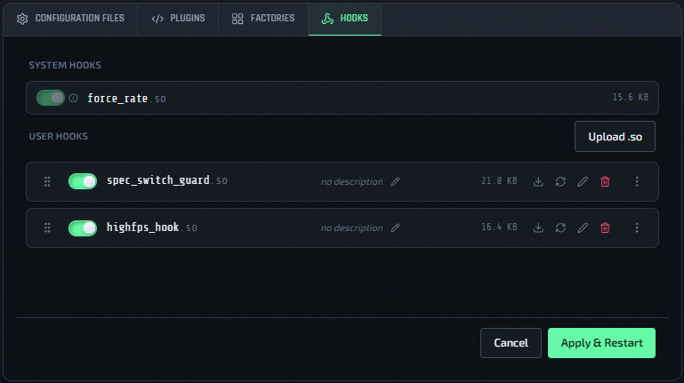

# LD_PRELOAD Hooks

The **Hooks** tab in the instance config editor manages LD_PRELOAD libraries — native `.so` files that are loaded into the QLDS process before it starts.

## Why LD_PRELOAD Hooks

Some low-level behaviors in Quake Live can only be changed by patching the running process. LD_PRELOAD lets a small native library intercept or replace specific C functions inside `qzeroded.x64` at launch time. QLSM uses this mechanism for [99k LAN rate](99k-lan-rate.md) and exposes the same mechanism to you for custom use.

## Two Kinds Of Hooks

### System Hooks

System hooks are managed by QLSM and are read-only. They appear in the Hooks tab but cannot be removed or reordered by you — they are always loaded when their associated feature is enabled.

The only current system hook is **`force_rate.so`**, which is automatically registered when [99k LAN rate](99k-lan-rate.md) is enabled for an instance.

### User Hooks

User hooks are `.so` files you upload yourself. They are fully under your control: you can upload, enable/disable, reorder, and delete them.

QLSM validates that uploaded files are ELF binaries (checks the magic bytes). Non-ELF files are rejected at upload time.

## Managing User Hooks

### Upload A Hook

1. Open an instance config editor (Actions → Edit Config).
2. Click the **Hooks** tab.
3. Click **Upload** and select your `.so` file.

After uploading, the hook appears in the list in disabled state.

Uploads are stored immediately on the QLSM server. The new binary is copied to the game host the next time you click **Save Configuration**.

### Enable Or Disable A Hook

Toggle the switch on the hook row, then click **Save Configuration**. Hook selections are saved with the rest of the instance configuration.

### Reorder Hooks

Drag hook rows to change the load order. Hooks are passed to `LD_PRELOAD` in top-to-bottom order. System hooks always load before user hooks regardless of position.

Reordering is also saved through **Save Configuration**.

### Delete A Hook

Click the delete (trash) icon on the hook row and confirm in the modal. Deleting a hook removes it from the game host on the next **Save Configuration** sync.

Deletes happen immediately on the QLSM server. The removed binary and any resulting `LD_PRELOAD` changes are reflected on the game host the next time you click **Save Configuration**.

## Saving Hook Changes

Hook enable/disable and reorder changes use the same **Save Configuration** button as config, plugin, factory, and basic instance settings.

- **Running instances:** hook changes require the QLDS process to restart so `LD_PRELOAD` can be rebuilt. QLSM forces the restart toggle on and disables it for that save; clicking **Save Configuration** syncs files, templates the systemd unit, and restarts the instance automatically.
- **Stopped instances:** clicking **Save Configuration** syncs files and templates the systemd unit, but the instance stays stopped. Start it manually when you are ready to run with the new hook set.
- **File uploads/deletes:** upload and delete operations happen immediately on the QLSM server, but hook binaries are copied to or removed from the game host only on the next **Save Configuration**.

## Missing Hooks

If a hook file exists in the database but its binary is missing from the host filesystem, QLSM shows a warning row with the filename highlighted. Click the remove button on that row to delete the stale entry. This can happen if host files were deleted out-of-band.

If a missing hook remains selected, QLSM drops it on the next **Save Configuration**. Stale `LD_PRELOAD` entries can block the server from starting, so missing binaries are not preserved indefinitely.

## Load Order

When an instance starts, QLSM builds the `LD_PRELOAD` value in this order:

1. Enabled system hooks (e.g. `force_rate.so` when 99k LAN rate is on)
2. Enabled user hooks in the order shown in the Hooks tab

## Hooks In Presets

The **Load Preset** and **Save Preset** buttons are available on the Hooks tab, the same as every other tab in the editor.

Saving a preset from an instance also records which user hooks were enabled (and their load order) — capturing the current selection shown in the Hooks tab, including changes you haven't saved yet. Loading that preset onto another instance and saving replaces the target instance's enabled hooks to match — see [Presets And Default Config](../presets/overview.md).

## Related Pages

- [99k LAN Rate](99k-lan-rate.md) — uses `force_rate.so` as a system hook
- [Edit Configs, Plugins, And Factories](../operations/edit-configs.md)
- [Instance Actions Menu](../operations/instance-actions-menu.md)
- [Presets And Default Config](../presets/overview.md)
