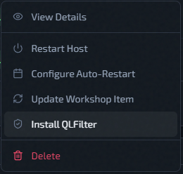
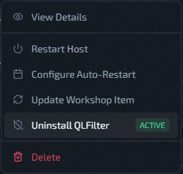

# QLFilter

QLFilter is an optional host-level anti-DDoS filter for Quake Live servers. It drops reflection garbage before it ever reaches the QLDS process.

## The Problem It Solves

Public-facing QLDS UDP ports can be targeted by malicious actors with junk or reflected UDP traffic. This can include DNS, SSDP, and similar amplification/reflection packets sent at the server rather than legitimate player traffic. At high enough volume, these attacks can waste bandwidth, add load, and interfere with real game traffic.

## How It Works

QLFilter operates at a very low level in Linux using **eBPF and XDP** — the eXpress Data Path. XDP hooks into the network driver itself, before the packet even enters the Linux networking stack. Packets that match known junk patterns (DNS, SSDP, and similar reflection garbage) are dropped at wire speed, before they consume CPU or reach QLDS.

The result: your Quake Live server only sees legitimate player traffic.

## Installation

QLFilter is installed per host, not per instance. All instances on a host share one QLFilter installation.

1. Go to **Servers**.
2. Open the host's [Actions menu](../operations/host-actions-menu.md).
3. Click **Install QLFilter**.

4. Wait for the status indicator to show **Active**.

While QLFilter is installing, other host management actions are temporarily locked.

## Uninstallation

1. Open the host's [Actions menu](../operations/host-actions-menu.md).
2. Click **Uninstall QLFilter**.

3. Wait for the status to return to **Not Installed**.

## Status Reference

| Status | Meaning |
|--------|---------|
| Not Installed | QLFilter is not present on this host |
| Installing | Install in progress — host actions locked |
| Active | QLFilter running and filtering |
| Inactive | Installed but not currently running |
| Uninstalling | Removal in progress |
| Error | Install or uninstall failed — see [Deployment Troubleshooting](../help/deployment-troubleshooting.md) |

## Related Pages

- [Host Actions Menu](../operations/host-actions-menu.md)
- [Add A Host (Cloud Or Standalone)](../getting-started/add-host.md)
- [Deployment Troubleshooting](../help/deployment-troubleshooting.md)
