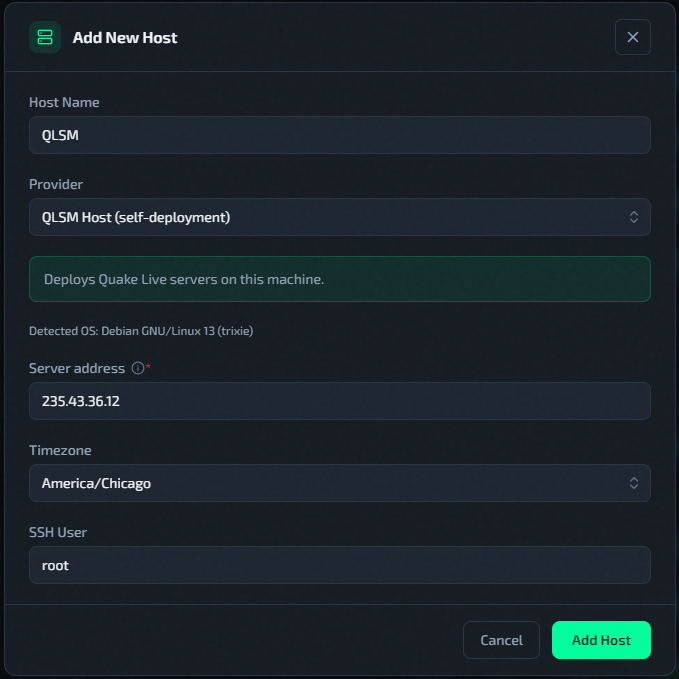
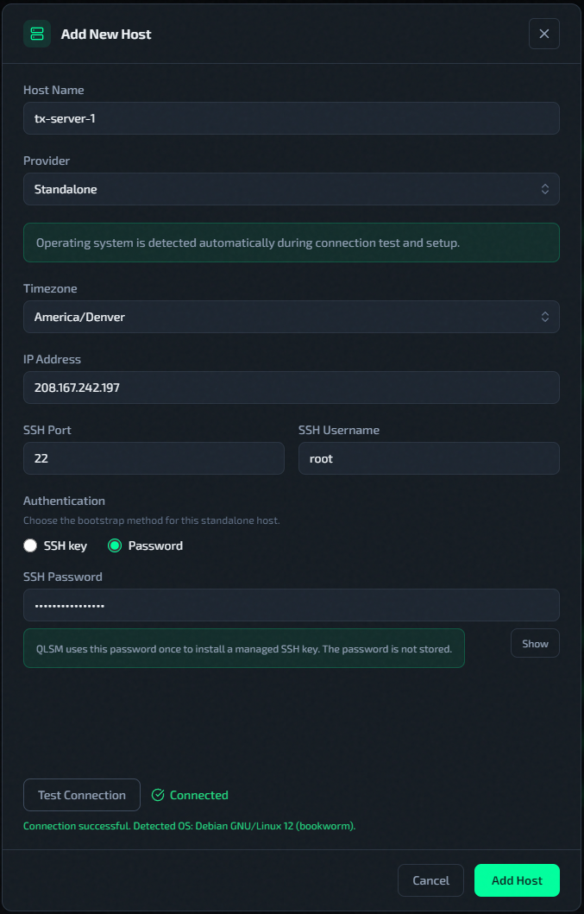
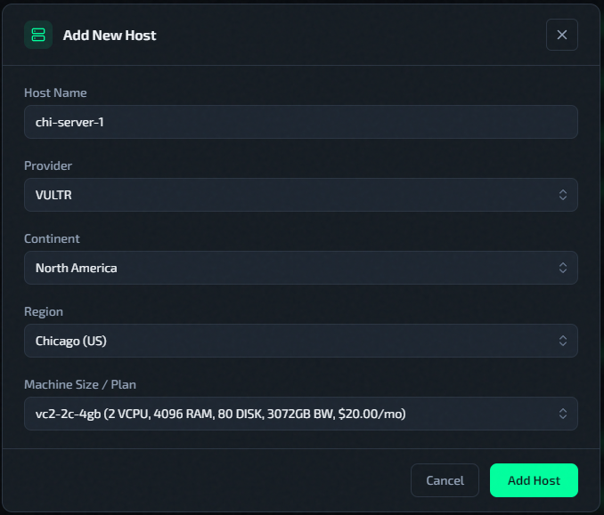

# Add A Host (Cloud Or Standalone)

Hosts are added from **Servers** -> **Add New Host**. 

## Supported OS

Use **Debian 12**.
Ubuntu is supported as well, but [99k LAN rate](../features/99k-lan-rate.md) is not compatible with Ubuntu. This guide and production workflow assume Debian 12.

## Self-Host Deployment

The **QLSM Host (self)** provider runs game servers on the same machine that runs the QLSM Docker stack. Useful when you already have a spare Linux box and don't want a separate VM just for game servers.

1. Set **Provider** to `QLSM Host (self)`.
2. The form shows the detected OS, pre-fills the inferred SSH user, and may pre-fill **Server address** if `QLSM_HOST_IP` is configured. Verify these values before continuing.
3. Set **Timezone**.
4. Click `Add Host` button to submit the form.
5. Wait until setup finishes and host is **Active**.




QLSM generates and manages its own SSH key for self-host automation. Your personal SSH keys are never accessed.

For self-host setup, the SSH user can be `root` or another account with passwordless `sudo` privileges. QLSM uses that account as the management login for automation tasks.

During setup, QLSM creates a dedicated `ql` system user for Quake Live files and services. Game server assets and processes run under `ql`, but QLSM continues to connect as the configured management account when it needs to automate the host later.

Only one `QLSM Host (self)` deployment may exist at a time.

## Standalone Workflow

1. Set **Provider** to `Standalone`.
2. Fill:
   * Host Name
   * IP Address
   * SSH Port
   * SSH Username
   * SSH Private Key (or password for bootstrap — QLSM installs a managed key then discards the password)
   * Timezone
3. Run **Test Connection** and confirm it shows **Connected**. OS is auto-detected during the connection test.
4. Click `Add Host` button to submit the form.
5. Wait until setup finishes and host is **Active**.




## Vultr Cloud Deployment

### Prerequisites

Create a Vultr API key by following Vultr's official guide: [Create New API Key](https://docs.vultr.com/platform/other/api/other-user/create-api-key). Copy and store the key immediately because Vultr only shows it once.

Set `VULTR_API_KEY` in the QLSM environment before using Vultr provisioning.

**One-liner install** — pass the key inline:

```bash
VULTR_API_KEY=your_vultr_api_key bash <(curl -fsSL https://raw.githubusercontent.com/dngrtech/qlsm/main/qlsm-install.sh)
```

**Git clone / manual install** — edit `.env` before starting:

```bash
# In .env, find and uncomment this line:
VULTR_API_KEY=your_vultr_api_key
```

Then start with `docker compose up -d`.

One-line install example with both a domain and Vultr provisioning:

```bash
SITE_ADDRESS=qlsm.example.com VULTR_API_KEY=your_vultr_api_key bash <(curl -fsSL https://raw.githubusercontent.com/dngrtech/qlsm/main/qlsm-install.sh)
```

### Workflow

1. Set **Provider** to `VULTR` cloud provider.
2. Select **Continent**, **Region**, and **Machine Size / Plan**.
3. Click `Add Host` button to submit the form.
4. Wait until host status reaches **Active**.



Cloud hosts inherit timezone from selected region. That timezone is later used by [Configure Auto-Restart](../operations/auto-restart.md).

## Timezone Requirement

Timezone is operational, not cosmetic.

- [Configure Auto-Restart](../operations/auto-restart.md) executes in host local timezone.
- Wrong timezone means restart at the wrong local hour.
- Wrong restart time delays Workshop item refresh on running servers.

Continue with: [Configure Auto-Restart](../operations/auto-restart.md)

## Related Pages

- [Deploy A New Instance](deploy-new-instance.md)
- [Host Actions Menu](../operations/host-actions-menu.md)
- [Deployment Troubleshooting](../help/deployment-troubleshooting.md)
