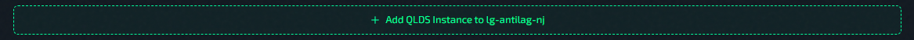
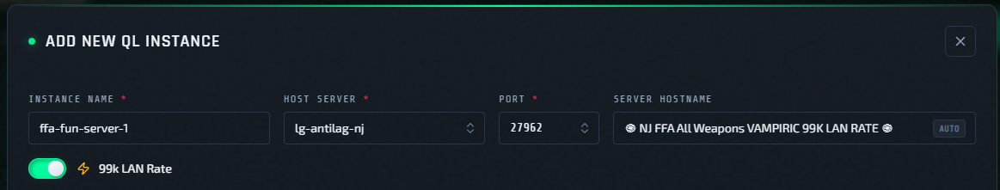

# Deploy A New Instance

Open from **Servers** -> host row -> **Add QLDS Instance to &lt;host&gt;**.

   

Prerequisite: [Add A Host](add-host.md)

Host limit: each host can have a maximum of **4 instances**. If a host already has 4, deploy the new instance to a different host or remove an existing one first.

## Default Preset Behavior

When the add new QLDS instance form opens, config is preloaded from the **default preset**.

- Default preset is a built-in baseline template — it cannot be modified or deleted.
- Modify the preloaded values freely before deploying; those changes only affect this instance.
- To save a customized starting point, use **Save As New** to create your own preset.

Preset details: [Presets And Default Config](../presets/overview.md)

## Basic Info Block

Required fields:

- **Instance Name**
- **Host Server**
- **Port**
- **Server Hostname** (this is auto-synced with `sv_hostname` value)

Optional toggle:

- [**99k LAN Rate**](../features/99k-lan-rate.md)

`99k LAN Rate` controls LAN-rate profile for the instance.
Changing this later from the actions menu triggers reconfigure/restart.
Reference: [Instance Actions Menu](../operations/instance-actions-menu.md)

## Main Tabs In Deploy Form

Config editing details live here: [Edit Configs, Plugins, And Factories](../operations/edit-configs.md)

## Create Instance

1. Review fields and tabs.
2. Click **Create Instance**.
3. Wait until status leaves transitional states and reaches running/healthy state.

## What Happens To Config After Deploy

QLSM deploys QLDS instance and pushes full config snapshot (configs, plugins, and factories) to that instance.

- Later edits affect only that instance.
- Other instances are unchanged.
- Default preset files remain unchanged.

Next pages:

- [Instance Actions Menu](../operations/instance-actions-menu.md)
- [Host Actions Menu](../operations/host-actions-menu.md)
- [RCON Console](../operations/rcon-console.md)
- [Use Logs And Chat Logs](../operations/logs-and-chat.md)
- [Deployment Troubleshooting](../help/deployment-troubleshooting.md)
