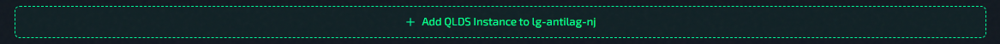
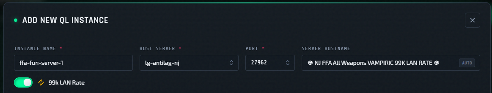

# Deploy A New Instance

Open from **Servers** -> host row -> **Add QLDS Instance to &lt;host&gt;**.

   

Prerequisite: [Add A Host](add-host.md)

Host limit: each host can have a maximum of **8 instances**, using game ports 27960-27967. If a host is already full, deploy the new instance to a different host or remove an existing one first.

> **Hosts created before this limit was raised:** their firewall was configured to allow only the first four game ports. If you add a fifth or later instance to such a host and it is unreachable, [re-run host setup](../operations/host-actions-menu.md#re-run-host-setup) from the host's actions menu to refresh the firewall rules. Hosts you manage yourself (self and standalone) refresh their rules automatically on the next instance operation.

## Default Preset Behavior

When the add new QLDS instance form opens, config is preloaded from the **default preset**.

- Default preset is a built-in baseline template — it cannot be modified or deleted.
- Which default preset loads, and which plugins come with it, depends on the selected host's [Server Runtime](add-host.md#server-runtime): minqlx hosts start from `default`, minqlxtended hosts start from `default-minqlxtended`. Switching the **Host Server** field to a host on the other runtime reloads the form with that runtime's default preset and plugins, since the two runtimes don't share plugins.
- Modify the preloaded values freely before deploying; those changes only affect this instance.
- To save a customized starting point, use **Save Preset** and enter a new preset name.

Preset details: [Presets And Default Config](../presets/overview.md)

## Basic Info Block

Required fields:

- **Instance Name**
- **Host Server**
- **Port**
- **Server Hostname** (this is auto-synced with `sv_hostname` value)

Optional fields:

- [**99k LAN Rate**](../features/99k-lan-rate.md) (toggle)
- **Redis DB** (dropdown)
- **Auto Generate Passwords** (checkbox, on by default)

`99k LAN Rate` controls LAN-rate profile for the instance.
Changing this later from the actions menu triggers reconfigure/restart.
Reference: [Instance Actions Menu](../operations/instance-actions-menu.md)

`Redis DB` is a dropdown listing every DB from 1 to 8 for the selected host. An info icon next to a DB number means another instance on the host already uses it. Picking it anyway is fine if you want the two instances to share plugin state.

`Auto Generate Passwords` is on by default and means QLSM picks the instance's ZMQ stats and RCON passwords for you when it deploys. Turn it off to type your own — useful when an external stats collector or RCON client already expects a known password. Both fields are then required, and each must be 8 to 64 characters using only letters, digits, `-`, `_`, and `=`. Other characters are rejected because they get mangled on the way to the game server's launch arguments. You can read either password back at any time from the instance details panel.

## Main Tabs In Deploy Form

Config editing details live here: [Edit Configs, Plugins, And Factories](../operations/edit-configs.md)

The deploy form uses the same file manager as **Edit Config**. Before creating the instance you can add custom `.cfg` or `.txt` config files, create subfolders with `.ent` entity override files, stage plugin file changes, choose checked plugins, select the `.factories` files that should be deployed, and configure preset-provided LD_PRELOAD hooks.

### Hooks Before Deployment

The **Hooks** tab shows the user hooks supplied by the currently loaded preset. The form starts with the `default` preset's hook files, enabled state, and load order; loading another preset replaces that draft with the selected preset's hook configuration.

- Toggle a hook to enable or disable it for the new instance.
- Drag hooks to change their LD_PRELOAD order.
- Upload, rename, and delete are unavailable until the instance exists. Use **Edit Config** on an existing instance to manage hook files.

Hook enablement and ordering count as draft changes. Saving a preset from the deploy form preserves the hook configuration shown in the tab.

## Create Instance

1. Review fields and tabs.
2. Click **Create Instance**.
3. Wait until status leaves transitional states and reaches running/healthy state.

## What Happens To Config After Deploy

QLSM deploys the QLDS instance and pushes the full selected snapshot to it: configs, checked plugins, plugin files, checked factories, factory file contents, preset user-hook files, and the enabled hook order.

- Later edits affect only that instance.
- Other instances are unchanged.
- Default preset files remain unchanged.

Next pages:

- [Instance Actions Menu](../operations/instance-actions-menu.md)
- [Host Actions Menu](../operations/host-actions-menu.md)
- [RCON Console](../operations/rcon-console.md)
- [Use Logs And Chat Logs](../operations/logs-and-chat.md)
- [Deployment Troubleshooting](../help/deployment-troubleshooting.md)
