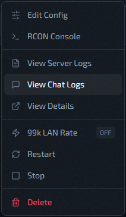
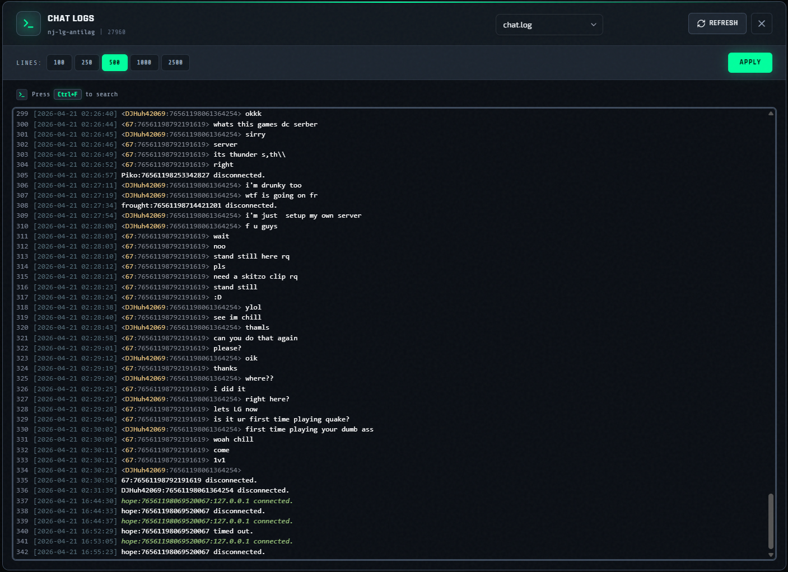

# Chat Logs

Use **View Chat Logs** from the instance action menu to read `chat.log` and rotated chat archives.

## File Selection

The modal loads available files and keeps valid names only:

- `chat.log`
- `chat.log.<number>` (for example `chat.log.1`)

Sorting behavior:

1. `chat.log` first
2. then numeric archives in ascending order (`.1`, `.2`, ...)

The UI keeps at most 11 entries (current file + 10 archives).

## Line Filtering

Line presets: `100`, `250`, `500`, `1000`, `2500`

## Viewer Behavior

- Read-only CodeMirror display
- Auto-scroll to bottom after load
- `Ctrl+F` to search in-place
- **`Refresh`** and **`Apply`** both re-fetch current file + line count
