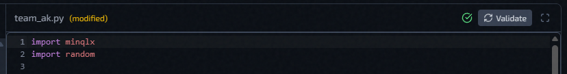
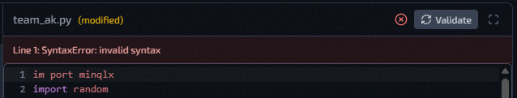

# Edit Configs, Plugins, And Factories

## Configuration Files

The **Config** tab uses the file manager. These protected baseline files are always present:

- `server.cfg`
- `mappool.txt`
- `access.txt`
- `workshop.txt`

Protected files can be edited, but they cannot be renamed or deleted. You can also add custom flat `.cfg` and `.txt` files with **New** or **Upload**. Custom config files can be renamed or deleted.


## Editor Buttons

The file manager includes these controls where the file type supports them:

- Create a new file
- Upload file content 
- Rename or delete a selected custom file
- Copy content 
- Expand to full-screen editor 

Use **Upload** when you want to bring in an existing file from another server. Use **Copy** when you want to export the current text. Use **Expand** when you need more room for editing.

## Linting

- `server.cfg` shows inline lint diagnostics.
- In the deploy form, instance creation is blocked if `server.cfg` has blocking lint errors.

## Restart After Saving


- If **Restart after saving** is enabled, QLSM syncs the updated config to the instance and immediately restarts it, so the new config is applied right away.
- If **Restart after saving** is disabled, QLSM still pushes and syncs the updated config to the instance, but it is not applied until that instance is restarted later.

## Managed `server.cfg` Cvars

QLSM applies several runtime cvars outside the raw `server.cfg` text during deploy, restart, and config apply.

These cvars are ignored by QLSM regardless of whether they are present in `server.cfg`.

| Cvar | How QLSM manages it | Effect of value in `server.cfg` |
| --- | --- | --- |
| `net_port` | Stored as the instance port and passed at launch. | Ignored. A value in `server.cfg` does not change the instance port. |
| `sv_serverType` | Controlled by the 99k LAN rate toggle. | Ignored. QLSM injects `1` when 99k LAN rate is enabled, otherwise `2`. |
| `sv_lanForceRate` | Controlled by the 99k LAN rate toggle. | Ignored. QLSM injects `1` when 99k LAN rate is enabled, otherwise `0`. |
| `net_strict` | Forced by QLSM. | Ignored. QLSM always injects `1`. |
| `qlx_serverBrandName` | Derived from the instance hostname. | Ignored. QLSM overwrites it to match `sv_hostname`. |
| `qlx_redisAddress` | Forced by QLSM. | Ignored. QLSM injects the local Redis address. |
| `qlx_redisPassword` | Forced by QLSM. | Ignored. QLSM injects the backend Redis password. |
| `qlx_redisDatabase` | Derived from the instance port. | Ignored. QLSM injects `port - 27959`. |
| `fs_homepath` | Derived from the instance port. | Ignored. QLSM injects `/home/ql/qlds-<port>`. |
| `qlx_pluginsPath` | Derived from `fs_homepath`. | Ignored. QLSM injects the instance minqlx plugin path. |
| `zmq_rcon_enable` | Forced by QLSM. | Ignored. QLSM always injects `1`. |
| `zmq_rcon_port` | Deterministically generated from the game port. | Ignored. QLSM injects `28888 + (port - 27960)`. |
| `zmq_rcon_password` | Generated and stored by QLSM. | Ignored. QLSM injects the instance secret. |
| `zmq_stats_port` | Deterministically generated from the game port. | Ignored. QLSM injects `29999 + (port - 27960)`. |
| `zmq_stats_password` | Generated and stored by QLSM. | Ignored. QLSM injects the instance secret. |
| `qlx_plugins` | Built from the **Plugins** tab selection. | Ignored. QLSM injects the Plugins tab selection. |

### What the command line looks like

QLSM assembles all managed cvars into a single argument string that is passed to the QLDS binary at launch. The two examples below use real variable names from the instance record.

**Example command line arguments with 99k LAN rate enabled** (`sv_serverType 1`, `sv_lanForceRate 1`):

```
/home/ql/qlds-$port/run_server_x64_minqlx.sh
  +set sv_serverType 1
  +set sv_lanForceRate 1
  +set net_strict 1
  +set net_port $port
  +set sv_hostname "$hostname"
  +set qlx_serverBrandName "$hostname"
  +set qlx_redisAddress "127.0.0.1:6379"
  +set qlx_redisPassword "$redis_password"
  +set qlx_redisDatabase $redis_db_index
  +set fs_homepath /home/ql/qlds-$port
  +set qlx_pluginsPath /home/ql/qlds-$port/minqlx-plugins
  +set zmq_rcon_enable 1
  +set zmq_rcon_port $zmq_rcon_port
  +set zmq_rcon_password "$zmq_rcon_password"
  +set zmq_stats_port $zmq_stats_port
  +set zmq_stats_password "$zmq_stats_password"
  +set qlx_plugins "names of plugins from the Plugins tab selection"
```

## Plugins

The `Plugins` tab manages Python plugins for this instance:

- folders and files in the plugin tree
- `.py`, `.txt`, and native `.so` plugin files
- checkbox selection for which Python plugins are included in `qlx_plugins`
- `Validate` button for checking Python plugin files
- binary file details and descriptions for `.so` files


Use **New**, **Upload**, **Rename**, and **Delete** to stage plugin file changes. Plugin changes are saved through a draft workspace while the modal or deploy form is open; they are committed to the instance or preset only when you save, update, or create.

`.so` files are shown as binary files instead of text. You can replace the binary and add a short description so the file is easier to identify later.

### Validate Plugin

The **Validate** button appears when a Python plugin file is open. Use it to check the current editor contents for errors before saving or applying plugin changes.

When validation succeeds, QLSM confirms that the current plugin file passed its Python checks.



When validation fails, QLSM shows line-level errors above the editor. Fix the reported lines, then run `Validate` again.




## Factories

The **Factories** tab controls factory files included in the deployment bundle.

- Only selected factory files are applied to the instance.
- If you edit a factory file here, the edited version is what gets applied.
- You can create, upload, rename, and delete flat `.factories` files.


## Related Pages

- [Deploy A New Instance](../getting-started/deploy-new-instance.md)
- [Instance Actions Menu](instance-actions-menu.md)
- [Presets And Default Config](../presets/overview.md)
- [99k LAN Rate](../features/99k-lan-rate.md)
