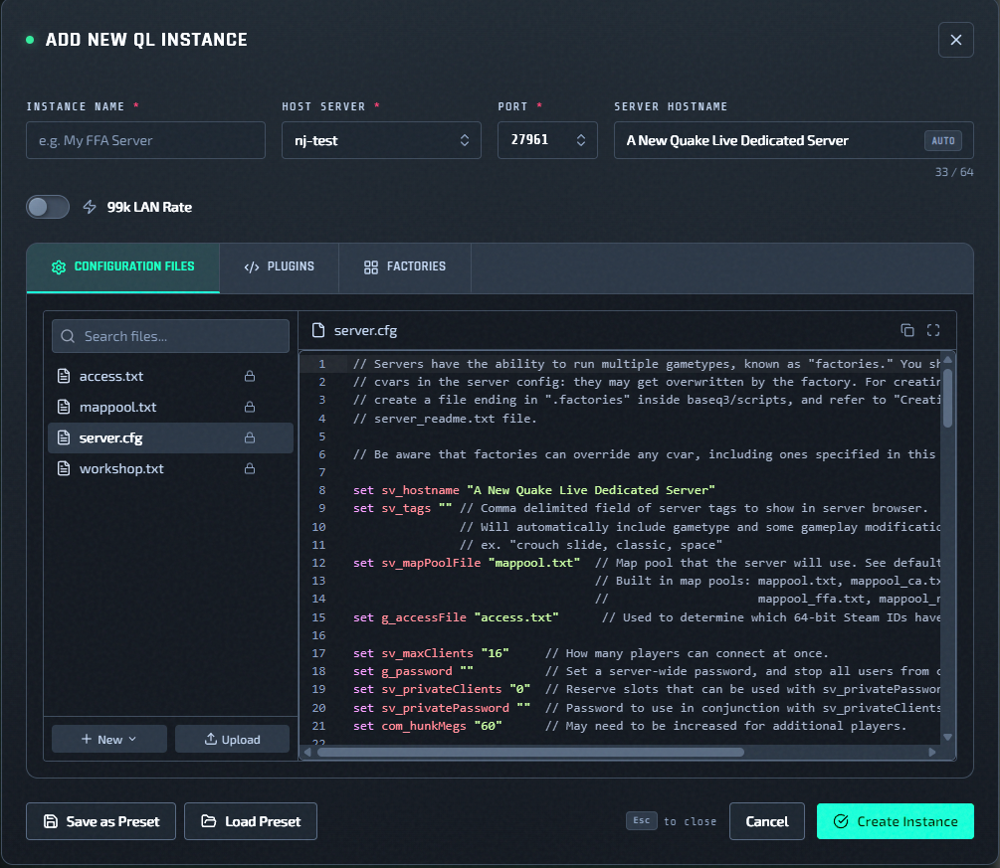
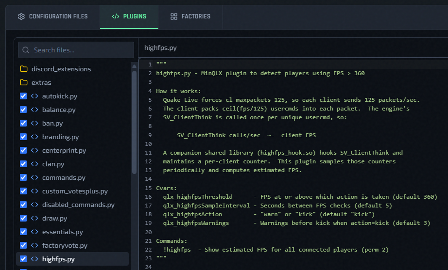
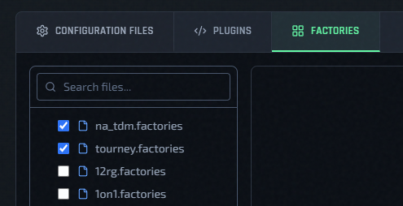

# Edit Configs, Plugins, And Factories

## Configuration Files

The config editor has file-level tabs for:

- `server.cfg`
- `mappool.txt`
- `access.txt`
- `workshop.txt`

## Editor Buttons

Each file editor includes these controls:

- Upload file content 
- Copy content 
- Expand to full-screen editor 

Use **Upload** when you want to paste in an existing file from another server. Use **Copy** when you want to export the current contents. Use **Expand** when you need more room for editing.

## Linting

- `server.cfg` shows inline lint diagnostics.
- In the deploy form, instance creation is blocked if `server.cfg` has blocking lint errors.

## Restart After Saving

- If **Restart after saving** is enabled, QLSM syncs the updated config to the instance and immediately restarts it, so the new config is applied right away.
- If **Restart after saving** is disabled, QLSM still pushes and syncs the updated config to the instance, but it is not applied until that instance is restarted later.

## Managed `server.cfg` Cvars

QLSM applies several runtime cvars outside the raw `server.cfg` text during deploy, restart, and config apply.

These cvars are ignored by QLSM regardless of whether they are present in `server.cfg`.

| Cvar | How QLSM manages it | Effect of value in `server.cfg` |
| --- | --- | --- |
| `net_port` | Stored as the instance port and passed at launch. | Ignored. A value in `server.cfg` does not change the instance port. |
| `sv_serverType` | Controlled by the 99k LAN rate toggle. | Ignored. QLSM injects `1` when 99k LAN rate is enabled, otherwise `2`. |
| `sv_lanForceRate` | Controlled by the 99k LAN rate toggle. | Ignored. QLSM injects `1` when 99k LAN rate is enabled, otherwise `0`. |
| `net_strict` | Forced by QLSM. | Ignored. QLSM always injects `1`. |
| `qlx_serverBrandName` | Derived from the instance hostname. | Ignored. QLSM overwrites it to match `sv_hostname`. |
| `qlx_redisAddress` | Forced by QLSM. | Ignored. QLSM injects the local Redis address. |
| `qlx_redisPassword` | Forced by QLSM. | Ignored. QLSM injects the backend Redis password. |
| `qlx_redisDatabase` | Derived from the instance port. | Ignored. QLSM injects `port - 27959`. |
| `fs_homepath` | Derived from the instance port. | Ignored. QLSM injects `/home/ql/qlds-<port>`. |
| `qlx_pluginsPath` | Derived from `fs_homepath`. | Ignored. QLSM injects the instance minqlx plugin path. |
| `zmq_rcon_enable` | Forced by QLSM. | Ignored. QLSM always injects `1`. |
| `zmq_rcon_port` | Deterministically generated from the game port. | Ignored. QLSM injects `28888 + (port - 27960)`. |
| `zmq_rcon_password` | Generated and stored by QLSM. | Ignored. QLSM injects the instance secret. |
| `zmq_stats_port` | Deterministically generated from the game port. | Ignored. QLSM injects `29999 + (port - 27960)`. |
| `zmq_stats_password` | Generated and stored by QLSM. | Ignored. QLSM injects the instance secret. |
| `qlx_plugins` | Built from the **Plugins** tab selection. | Ignored. QLSM injects the Plugins tab selection. |

## Plugins

The **Plugins** tab manages Python plugins for this instance:

- file tree plus editor
- checkbox selection for which plugins are included
- **Validate** button runs Python validation and reports line-level errors

## Factories

The **Factories** tab controls factory files included in the deployment bundle.

- Only selected factory files are applied to the instance.
- If you edit a factory file here, the edited version is what gets applied.

## Related Pages

- [Deploy A New Instance](../getting-started/deploy-new-instance.md)
- [Instance Actions Menu](instance-actions-menu.md)
- [Presets And Default Config](../presets/overview.md)
- [99k LAN Rate](../features/99k-lan-rate.md)
