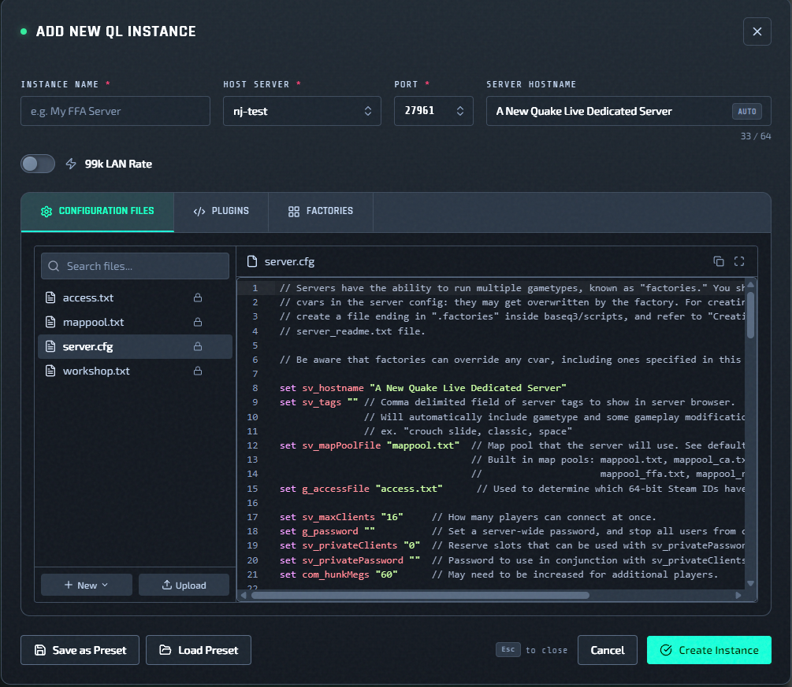
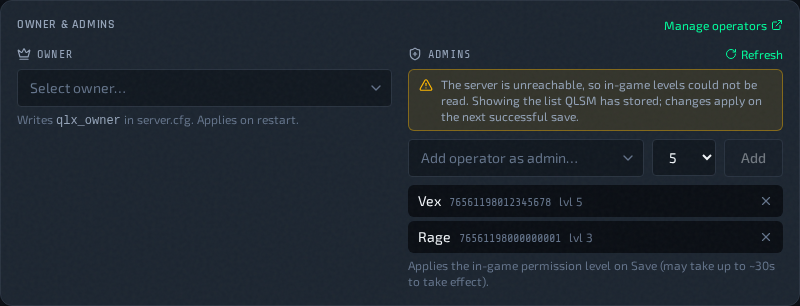
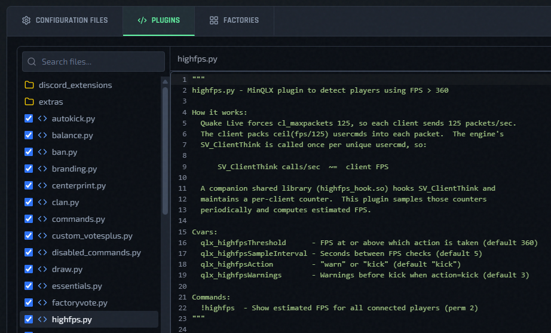
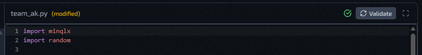
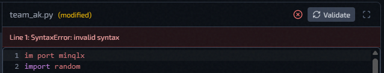
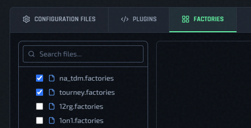

# Edit Configs, Plugins, Factories, And Hooks

## Configuration Files

The **Config** tab uses the file manager. These protected baseline files are always present:

- `server.cfg`
- `mappool.txt`
- `access.txt`
- `workshop.txt`

Protected files can be edited, but they cannot be renamed or deleted. You can also add custom flat `.cfg` and `.txt` files with **New** or **Upload**. Custom config files can be renamed or deleted.

You can also create **subfolders** (one level deep) to hold `.ent` entity override files. Use the **New** dropdown and choose **New Folder** to create a subfolder, then add `.ent` files inside it. Subfolders and the `.ent` files within them can be renamed or deleted via the row context menu (⋮).



## Owner & Admins

The **Owner & Admins** tab, to the right of **Hooks**, lets you assign people
from the [Operators](../administration/operators.md) directory without
hand-editing `server.cfg` or `access.txt`. Pick an **Owner** to write
`qlx_owner`, or add an operator as an **Admin** with a level from 0 to 5 to
write a `steamid|level` line to `access.txt`.



When you click **Save Configuration**, QLSM also pushes the admin levels into
the running server's minqlx permissions. They can take up to about 30 seconds
to apply. Removing an admin sets their in-game level back to 0. If the push
fails, a warning appears in the instance log. See
[What Happens In-Game](../administration/operators.md#what-happens-in-game).

Typing a SteamID directly in the `access.txt` editor also suggests operators
from the directory.


## Editor Buttons

The file manager includes these controls where the file type supports them:

- Create a new file
- Upload file content 
- Rename or delete a selected custom file
- Copy content 
- Expand to full-screen editor 

Use **Upload** when you want to bring in an existing file from another server. Use **Copy** when you want to export the current text. Use **Expand** when you need more room for editing.

## Linting

- `server.cfg` shows inline lint diagnostics.
- In the deploy form, instance creation is blocked if `server.cfg` has blocking lint errors.

## Autocomplete

In `.cfg` files the editor suggests console commands at the start of a line, and cvar names after `set` or `seta`. Each suggestion shows a short description and, underneath it, **where that description came from** — so a line that was read off the cvar's name is never mistaken for a verified fact.

Two things are suggested, from two different places:

- **Engine and server cvars** come from the catalog the server keeps in `ui/data/ql_cvar_catalog.json`. It lists every cvar a live Quake Live dedicated server registers (a `listcvars` dump), with descriptions taken from the game's own annotated `server.cfg`, from its factory definitions, and from verified reference notes. Bitmask settings such as `g_startingWeapons` and `g_voteFlags` show their bit table, and settings the official factories use show real example values. Regenerate the catalog with `python scripts/gen_cvar_catalog.py` after refreshing its inputs in `scripts/cvar-catalog/`.
- **Plugin (`qlx_`) cvars** come from the plugins of the server you are editing, read from each plugin's `<plugin>.ql-plugin.json` manifest. Plugins that are enabled are offered first, plugins that are only present are offered below them, and a plugin that isn't on this server is not offered at all. A plugin you uploaded yourself counts exactly as much as a bundled one.

Cvars QLSM sets itself (ports, passwords, Redis, plugin list) are marked as app-managed, the same ones the linter flags when you set them by hand.

`.factories` files get their own suggestions: the keys of a factory definition, the base gametypes for `basegt`, and cvar names inside the `cvars` block — with the cvars the game's own factories actually use offered first.

## Restart After Saving


- If **Restart after saving** is enabled, QLSM syncs the updated config to the instance and immediately restarts it, so the new config is applied right away.
- If **Restart after saving** is disabled, QLSM still pushes and syncs the updated config to the instance, but it is not applied until that instance is restarted later.

When restart is skipped, the instance remains **Updated** until QLSM confirms that
the service has started a new runtime and that runtime has reported live status.
This applies to both configuration saves and Workshop updates and also covers the
next scheduled auto-restart. An instance that was already stopped remains
**Stopped** after a no-restart Workshop update.

When a managed or manual restart is requested through QLSM, the instance returns
to **Running** promptly after Ansible completes.

## Managed `server.cfg` Cvars

QLSM applies several runtime cvars outside the raw `server.cfg` text during deploy, restart, and config apply.

These cvars are ignored by QLSM regardless of whether they are present in `server.cfg`.

| Cvar | How QLSM manages it | Effect of value in `server.cfg` |
| --- | --- | --- |
| `net_ip` | Forced by QLSM. | Ignored. QLSM always injects `""` (binds all interfaces, required for 99k LAN rate to work). |
| `net_port` | Stored as the instance port and passed at launch. | Ignored. A value in `server.cfg` does not change the instance port. |
| `sv_serverType` | Controlled by the 99k LAN rate toggle. | Ignored. QLSM injects `1` when 99k LAN rate is enabled, otherwise `2`. On minqlxtended hosts QLSM always injects `1`. |
| `sv_lanForceRate` | Controlled by the 99k LAN rate toggle. | Ignored. QLSM injects `1` when 99k LAN rate is enabled, otherwise `0`. On minqlxtended hosts QLSM always injects `1` — see [99k LAN Rate](../features/99k-lan-rate.md). |
| `net_strict` | Forced by QLSM. | Ignored. QLSM always injects `1`. |
| `qlx_redisAddress` | Forced by QLSM. | Ignored. TCP hosts: `127.0.0.1:6379`. Socket-enabled hosts: `/var/run/redis/redis.sock`. |
| `qlx_redisUnixSocket` | Forced by QLSM. | Ignored. Set to `1` on socket-enabled hosts; omitted on TCP hosts. |
| `qlx_redisPassword` | Forced by QLSM. | Ignored. QLSM injects the backend Redis password (self-host only). |
| `qlx_redisDatabase` | Chosen when the instance is created ([Deploy A New Instance](../getting-started/deploy-new-instance.md)), otherwise derived from the instance port. | Ignored. QLSM injects the chosen DB, or `port - 27959` if none was chosen. |
| `fs_homepath` | Derived from the instance port. | Ignored. QLSM injects `/home/ql/qlds-<port>`. |
| `qlx_pluginsPath` | Derived from `fs_homepath`. | Ignored. QLSM injects the instance minqlx plugin path. |
| `zmq_rcon_enable` | Forced by QLSM. | Ignored. QLSM always injects `1`. |
| `zmq_rcon_port` | Deterministically generated from the game port. | Ignored. QLSM injects `28888 + (port - 27960)`. |
| `zmq_rcon_password` | Generated and stored by QLSM. | Ignored. QLSM injects the instance secret. |
| `zmq_stats_port` | Deterministically generated from the game port. | Ignored. QLSM injects `29999 + (port - 27960)`. |
| `zmq_stats_password` | Generated and stored by QLSM. | Ignored. QLSM injects the instance secret. |
| `qlx_plugins` | Built from the **Plugins** tab selection. | Ignored. QLSM injects the Plugins tab selection. |

### What the command line looks like

QLSM assembles all managed cvars into a single argument string that is passed to the QLDS binary at launch. The two examples below use real variable names from the instance record.

**Example command line arguments with 99k LAN rate enabled** (`sv_serverType 1`, `sv_lanForceRate 1`):

```
/home/ql/qlds-$port/run_server_x64_minqlx.sh
  +set sv_serverType 1
  +set sv_lanForceRate 1
  +set net_strict 1
  +set net_port $port
  +set sv_hostname "$hostname"
  +set qlx_redisAddress "127.0.0.1:6379"
  +set qlx_redisPassword "$redis_password"
  +set qlx_redisDatabase $redis_db_index
  +set fs_homepath /home/ql/qlds-$port
  +set qlx_pluginsPath /home/ql/qlds-$port/minqlx-plugins
  +set zmq_rcon_enable 1
  +set zmq_rcon_port $zmq_rcon_port
  +set zmq_rcon_password "$zmq_rcon_password"
  +set zmq_stats_port $zmq_stats_port
  +set zmq_stats_password "$zmq_stats_password"
  +set qlx_plugins "names of plugins from the Plugins tab selection"
```

**Socket-enabled host — Redis-specific args only** (cloud or standalone after Re-run Host Setup). All other managed cvars are the same as the example above; only the Redis lines differ:

```
+set qlx_redisAddress "/var/run/redis/redis.sock"
+set qlx_redisUnixSocket 1
+set qlx_redisDatabase $redis_db_index
```

## Plugins

The `Plugins` tab manages Python plugins for this instance:

- folders and files in the plugin tree
- `.py`, `.txt`, native `.so` plugin files, and font files (`.ttf`, `.otf`, `.ttc`, `.otc`, `.woff`, `.woff2`, `.eot`, `.fon`, `.fnt`, `.pfb`, `.pfa`, `.pfm`, `.afm`) for plugins that bundle a font asset
- checkbox selection for which Python plugins are included in `qlx_plugins` — top-level
  `.py` files only. Files inside a subfolder have no checkbox: expand the folder and hover
  the info icon beside its name for the reason. Top-level `__init__.py` carries its own
  info icon in place of a checkbox.
- `Validate` button for checking Python plugin files
- binary file details and descriptions for `.so` files



Use **New**, **Upload**, **Rename**, and **Delete** to stage plugin file changes. Plugin changes are saved through a draft workspace while the modal or deploy form is open; they are committed to the instance or preset only when you save, update, or create.

`.so` files are shown as binary files instead of text. You can replace the binary and add a short description so the file is easier to identify later.

Font files are shown the same way — binary, download/replace-only — but without the description field. Like any other file in this tab, they always sync to the instance or preset; there's no separate "enable" toggle for a font, since it's just an asset your plugin's own code loads at runtime.

### Python Dependency Auto-Install

If your plugin directory contains a `requirements.txt` file, QLSM automatically runs `pip install -r requirements.txt` on the host every time you deploy or sync configs. You do not need to SSH into the host to install dependencies manually.

If pip encounters an error (e.g. a package unavailable on the host Python version), QLSM logs a warning but does not fail the deploy. Check the instance logs if a plugin behaves unexpectedly after a fresh deploy.

### Validate Plugin

The **Validate** button appears when a Python plugin file is open. Use it to check the current editor contents for errors before saving or applying plugin changes.

When validation succeeds, QLSM confirms that the current plugin file passed its Python checks.



When validation fails, QLSM shows line-level errors above the editor. Fix the reported lines, then run `Validate` again.



### Plugin Settings (Cvars)

A plugin can ship an optional `<plugin>.ql-plugin.json` file next to its `.py` file with metadata QLSM reads and displays — none of this is required for the plugin to work as a plain checkbox.

The central plugin pool (`ql-assets/data/minqlx-plugins/`) is the source of truth: if it has a manifest for a plugin with that filename, that's what's used everywhere the plugin appears — a preset or instance's own copy is not checked, even if it has its own (possibly outdated) sidecar. A local sidecar only applies as a fallback for a plugin the pool doesn't have at all, e.g. a custom/one-off plugin written directly for one preset or instance. This means metadata for a pool plugin can't drift between presets and instances, and updating the pool's manifest (adding `cvars`, for example) applies everywhere immediately, including already-deployed instances, without re-copying anything by hand.

If that file declares a `cvars` list, a settings (gear) icon appears next to the plugin's row. Click it to edit the plugin's cvars directly, instead of hand-editing `server.cfg`:

- **Toggle** for `bool` cvars.
- **Number field** (with min/max, when the manifest sets them) for `number` cvars.
- **Text field** for `string` cvars.

Saving writes each edited cvar as a `set <cvar> "<value>"` line into `server.cfg` — the same mechanism used to sync the **Hostname** field with `sv_hostname`. Values you don't touch keep whatever is already in `server.cfg` (or the manifest's declared default if the line isn't present yet). This is plain text editing under the hood, so it's still visible and editable directly in the **Config** tab afterward.

This is available both when editing an existing instance's config and when deploying a new instance.


## Factories

The **Factories** tab controls factory files included in the deployment bundle.

- Only selected factory files are applied to the instance.
- If you edit a factory file here, the edited version is what gets applied.
- You can create, upload, rename, and delete flat `.factories` files.




## Hooks

The **Hooks** tab manages LD_PRELOAD libraries — native `.so` files loaded into the QLDS process before it starts.

- **System hooks** are managed by QLSM and are read-only (e.g. `force_rate.so` when 99k LAN rate is on).
- **User hooks** are `.so` files you upload. You can enable/disable, reorder (drag), and delete them.

QLSM validates that uploaded files are ELF binaries. Non-ELF files are rejected at upload. If a hook binary is missing from the host, QLSM shows a warning row with an option to remove the stale entry.

Full guide: [LD_PRELOAD Hooks](../features/hooks.md)

## Related Pages

- [Deploy A New Instance](../getting-started/deploy-new-instance.md)
- [Instance Actions Menu](instance-actions-menu.md)
- [Presets And Default Config](../presets/overview.md)
- [99k LAN Rate](../features/99k-lan-rate.md)
- [LD_PRELOAD Hooks](../features/hooks.md)
