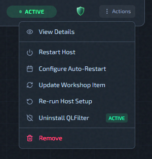

# Host Actions Menu

Open from host row **Actions** in the Servers page.

## Actions In This Menu

- **View Details**: opens host details drawer.
- **Restart Host**: queues host reboot flow. If the host takes longer than expected to come back and briefly shows **Error**, QLSM keeps probing it and restores it to **Active** automatically once it's reachable again — no manual action needed in that case.
- **[Configure Auto-Restart](auto-restart.md)**: opens restart schedule modal.
- **[Update Workshop Item](update-workshop-item.md)**: triggers workshop update on this host.
- **[Install/Uninstall QLFilter](../features/qlfilter.md)**: depends on current QLFilter state.
- **Re-run Host Setup**: re-applies the host configuration playbook on an existing host.
- **Delete / Remove**: removes host from management (or destroys cloud host).

## What QLFilter Is

QLFilter is a host-level anti-DDoS filter. It uses eBPF/XDP to drop reflection garbage (DNS, SSDP, and similar noise) at the network driver level before it ever reaches QLDS. One installation covers all instances on the host.

For a full explanation: [QLFilter](../features/qlfilter.md)

Operationally:

- Use **Install QLFilter** on new production hosts.
- Use **Uninstall QLFilter** only when you intentionally want it removed.

## QLFilter Behavior In Menu

The QLFilter action changes based on current QLFilter status:

- `not_installed`, `error`, `unknown` -> **Install QLFilter**
- `active`, `inactive` -> **Uninstall QLFilter**
- `installing`, `uninstalling` -> action shows busy state and is locked

While QLFilter is installing/uninstalling, other host management actions are also blocked.

## Update Workshop Item: Practical Use

1. Open **Update Workshop Item** from host actions.
2. Enter numeric Workshop Item ID.
3. Optionally pick running instances for automatic restart after update.
4. Submit and monitor instance status.

Full guide: [Update Workshop Item](update-workshop-item.md)

This is commonly paired with scheduled restart policy:
[Configure Auto-Restart](auto-restart.md)

## Re-run Host Setup

**Re-run Host Setup** re-applies the host configuration playbook to an existing host without reprovisioning it. Use this after a platform update that changes how the host is configured, when a previous setup run failed partway through, or to pick up infrastructure changes on an already-active host.

The action is available when the host status is **Active** or **Error**. While it runs, the host enters **Configuring** status and other management actions are blocked.

> **Self-hosted hosts** — Re-run Host Setup is available but does not modify Redis connectivity (self-host always uses TCP). On **cloud** and **standalone** hosts it applies the full setup, including any Redis configuration changes introduced in a platform update.

After the playbook completes, the host returns to **Active** status.

> **Running instances are automatically restarted** after a successful run. Plan for brief server downtime if you run this on a live host.

## Related Pages

- [Instance Actions Menu](instance-actions-menu.md)
- [Update Workshop Item](update-workshop-item.md)
- [Use Logs And Chat Logs](logs-and-chat.md)
- [Deployment Troubleshooting](../help/deployment-troubleshooting.md)
