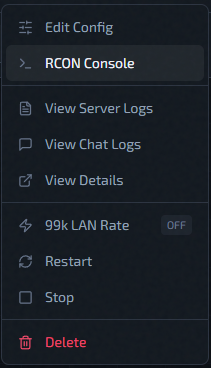

# RCON Console

RCON lets you send live commands to a running server.

To send one command to several instances at once, use
[Global RCON](global-rcon.md) instead.

## Open RCON

- Go to instance **Actions**.
- Click **RCON Console**.

If the button is disabled, the instance is usually not in a ready state yet.
Action reference: [Instance Actions Menu](instance-actions-menu.md)

## Basic Use

1. Type command in the input box, ie `status`.
2. Press **Send**.
3. Read output in the console panel.

## Real-Time Game Events

The console has a **Show real-time game events** checkbox enabled by default. When enabled, the output panel shows a live stats stream alongside command output.

## Quality-of-Life

- As you type, a list suggests console commands and cvar names (after `set`,
  `seta`, `reset`, or `toggle`, only cvars). Use Up/Down to move through it,
  **Tab** to take the highlighted (or top) suggestion, and **Esc** to close it.
  **Enter** takes a suggestion only if you moved to it; otherwise it sends what you typed.
- With no suggestion list open, Up/Down cycle through the last 50 commands.
- Output auto-trims to ~1000 lines; use `Ctrl+F` to search within it.
- Quake color codes are rendered in the output panel.

## Troubleshooting

| Symptom | Likely cause |
|---|---|
| RCON button disabled | Instance not in `running` / `active` / `updated` state |
| "RCON not configured" | Missing IP, port, or password on the instance or host |
| "Not authorized for this instance" | Room join did not complete before command was sent |
| Connection errors | Check Redis service and host reachability |

## Related Pages

- [Global RCON](global-rcon.md) — send one command to many instances.
- [Server Logs](server-logs.md)
- [Deployment Troubleshooting](../help/deployment-troubleshooting.md)
