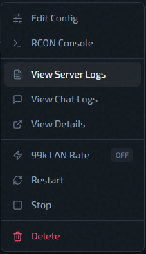
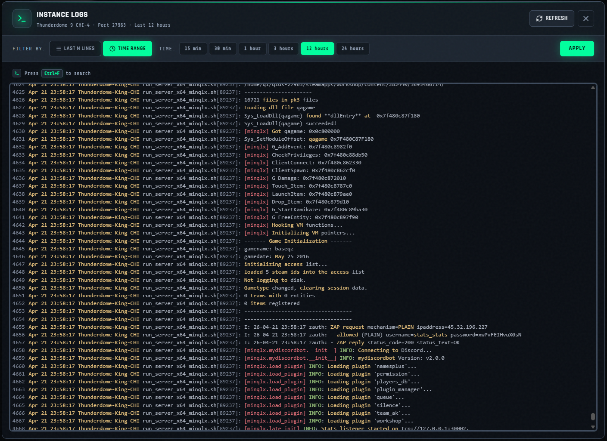

# Server Logs

Use **View Server Logs** from the instance action menu to fetch remote service logs.

## Filters in UI

### Filter modes

- **Last N Lines**
- **Time Range**

### Line presets

`100`, `250`, `500`, `1000`, `2500`

### Time presets

`15 min`, `30 min`, `1 hour`, `3 hours`, `12 hours`, `24 hours`

## Viewer Behavior

- Logs are displayed in a read-only CodeMirror panel.
- After load, scroll auto-jumps to bottom.
- Use `Ctrl+F` inside editor for search.
- **`Refresh`** and **`Apply`** trigger a new fetch.

