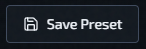
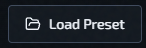
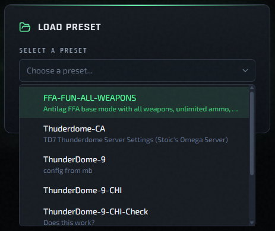
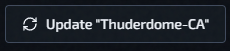

# Presets And Default Config

A preset is a reusable bundle of config files, plugin selections, and factory file selections. Use presets to spin up new instances with a consistent starting point, or to save a working setup so you can replicate it later.

## What A Preset Contains

- `server.cfg`
- `mappool.txt`
- `access.txt`
- `workshop.txt`
- A set of selected minqlx plugins (checkboxes, not a raw `qlx_plugins` string)
- A set of selected factory files

## Default Preset

Opening **Deploy New Instance** pre-loads config from the `default` preset. It is a baseline template. Treat it as read-only — use **Save As New** to create your own variants.

Use **Save as Preset** or **Save As New** when you want to turn the current draft into a reusable preset.

Use **Load Preset** any time you want to replace the default draft with one of your saved configurations.

## Plugin and Factory Selection

Instead of editing `qlx_plugins` manually, presets use checkboxes. Check the plugins you want; uncheck the ones you don't.

The same applies to factory files — select the factories that should be included when this preset is deployed.

This means you can have completely different plugin and factory sets per instance. Two instances on the same host can each have their own independent selection.

## Load A Saved Preset

Use **Load Preset** in the deploy form or in **Edit Config** to open the preset picker.

Loading a preset overwrites the current draft config with the saved preset contents.

- `default` stays available as the built-in baseline.
- Non-default presets can also be deleted from this modal.

## Custom Preset Workflow

1. Open **Deploy New Instance** (or **Edit Config** on an existing instance).
2. Adjust config files, plugin selections, and factory selections for your gamemode.
3. Click **Save as Preset** or **Save As New** and give it a name.
4. On future deployments, click **Load Preset** and select your saved preset.

## Update A Loaded Preset

If you load a non-default preset and then change the draft, the form exposes an **Update Preset** button.

Use **Update Preset** to overwrite the saved preset with your current draft.

- The button stays disabled until the loaded preset has changes.
- The built-in `default` preset cannot be updated.
- Use **Save As New** instead when you want a variant rather than replacing the original preset.

## Instance-Specific Ownership

A preset is only input at deploy time. After the instance is created, it keeps its own independent file set.

- Editing an instance's config later affects only that instance.
- Other instances are not affected.
- The original preset files are not modified.

## Related Pages

- [Deploy A New Instance](../getting-started/deploy-new-instance.md)
- [Instance Actions Menu](../operations/instance-actions-menu.md)
